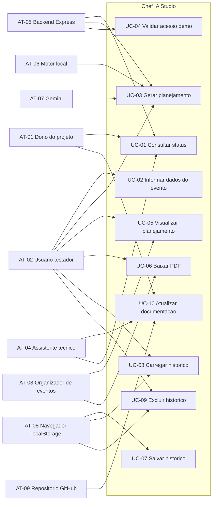
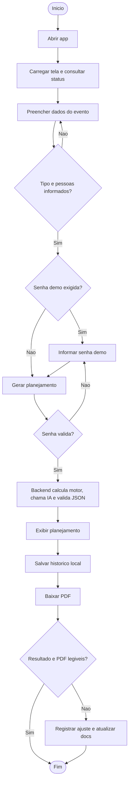

# Analise de Requisitos, Atores e Casos de Uso - Chef IA Studio

<!-- CODEX:LER_POR_PROCESSO
Ler este documento quando a proxima tarefa envolver comportamento do usuario, validacao, requisitos, atores ou mudanca no fluxo de uso.
Ele complementa MATERIAL_APOIO_PROCESSOS_E_REQUISITOS.md com casos de uso e criterios de validacao.
-->

<!-- CODEX:LER_POR_PROCESSO
Antes de alterar formulario, acesso demo, geracao, historico, PDF ou mensagens de erro, conferir os casos UC-01 a UC-10 e a matriz de validacao.
Depois da mudanca, atualizar o caso de uso afetado, requisito relacionado e dados de uso geral.
-->

<!-- CODEX:MANTER_EM_LINHA
Atualizar somente o caso, requisito ou validacao afetado. Manter IDs coerentes com RF/RNF.
Registrar no handoff se a mudanca afetar estado ou proximo passo.
-->

Documento vivo para organizar atores, requisitos, casos de uso, validacoes, dados de uso geral e fluxo de uso do Chef IA Studio.

Ultima atualizacao: 2026-07-09

## Resumo

O Chef IA Studio e um app local/portfolio para planejar eventos gastronomicos com apoio de IA. O usuario informa dados do evento, o backend calcula numeros operacionais com motor local, chama o Gemini, valida a resposta, renderiza um plano rico, salva historico local e permite baixar PDF.

Este documento existe para orientar mudancas de comportamento do produto. Ele nao substitui o handoff nem o roadmap; ele detalha como os usuarios e atores interagem com o sistema.

## Atores identificados

| ID | Ator | Tipo | Papel | Interesse | Observacao |
|---|---|---|---|---|---|
| AT-01 | Dono do projeto | Humano principal | Define prioridade e valida resultado | Portfolio/MVP local confiavel | Decide se uma melhoria entra agora ou vai para backlog. |
| AT-02 | Usuario testador | Humano principal | Preenche formulario e gera planejamento | Fluxo simples e resultado util | Pode ser amigo/convidado em teste controlado. |
| AT-03 | Organizador de eventos | Humano futuro | Usa plano para executar evento | Compras, equipe, cronograma e custo claros | Persona futura; hoje orienta qualidade do resultado. |
| AT-04 | Assistente tecnico | Suporte | Implementa, revisa e documenta | Preservar arquitetura e evitar retrabalho | Deve seguir marcadores `CODEX:`. |
| AT-05 | Backend Express | Sistema interno | Recebe evento, valida senha, coordena motor e IA | Resposta normalizada e segura | Nao expor chave no frontend. |
| AT-06 | Motor local | Sistema interno | Calcula quantidades, custos e logistica | Numeros previsiveis | Fonte dos numeros operacionais. |
| AT-07 | Gemini | Sistema externo | Gera conteudo criativo estruturado | Planejamento textual e detalhado | Deve receber prompt backend. |
| AT-08 | Navegador/localStorage | Sistema interno do cliente | Armazena historico local | Reuso de planejamentos | Limitado ao navegador/dispositivo. |
| AT-09 | Repositorio GitHub | Sistema de apoio | Versiona codigo e docs | Rastreabilidade e seguranca | `.env` nunca deve ser commitado. |

## Requisitos por ator

| Ator | Requisitos ligados | Resultado esperado |
|---|---|---|
| AT-01 Dono do projeto | RF-01 a RF-16, RNF-01, RNF-03, RNF-07 | Saber o que esta pronto, o que falta e qual proximo passo executar. |
| AT-02 Usuario testador | RF-02, RF-03, RF-08, RF-11, RF-12, RF-13, RF-14 | Acessar, gerar, entender erros e baixar PDF sem confusao. |
| AT-03 Organizador de eventos | RF-06, RF-08, RF-11, RF-15 | Receber um plano acionavel, com numeros, compras, equipe e cronograma. |
| AT-04 Assistente tecnico | RNF-01, RNF-03, RNF-04, RNF-07 | Fazer mudancas pequenas, alinhadas e documentadas. |
| AT-05 Backend Express | RF-02, RF-03, RF-04, RF-05, RF-07, RF-12, RF-16 | Coordenar fluxo com seguranca, validacao e fallback. |
| AT-06 Motor local | RF-06, RF-15 | Garantir calculos consistentes e evoluiveis. |
| AT-07 Gemini | RF-03, RF-05, RF-07 | Gerar JSON utilizavel e detalhado. |
| AT-08 Navegador/localStorage | RF-09, RF-10 | Salvar e recuperar historico no mesmo navegador. |
| AT-09 GitHub/repositorio | RNF-02, RNF-07 | Preservar historico sem vazar segredos. |

## Diagrama de caso de uso

Este diagrama e uma aproximacao UML em Mermaid. O formato formal de caso de uso nao e gerado aqui; o objetivo e mapear atores e interacoes principais de forma versionavel.



## Fluxo geral de uso



## Construção dos casos de uso

Padrao de criacao:

- ID: `UC-NN`.
- Nome: verbo no infinitivo ou acao clara.
- Ator primario: quem inicia ou se beneficia.
- Atores secundarios: sistemas ou pessoas de apoio.
- Pre-condicoes: o que precisa existir antes.
- Gatilho: evento que inicia o caso.
- Fluxo principal: passos esperados.
- Fluxos alternativos: erros, falta de dados ou excecoes.
- Saidas: tela, PDF, historico, documento ou resposta.
- Validacao: como saber que funcionou.
- Status: implementado, em melhoria, pendente ou futuro.

Regras:

- Caso de uso nao deve virar tarefa tecnica detalhada demais.
- Requisito novo deve apontar para RF/RNF quando possivel.
- Se o caso mexer em fluxo real, atualizar tambem o BPMN do material de apoio.
- Se mudar interface do usuario, atualizar validacao correspondente.

## Dados gerais de uso

### Dados do evento

| Campo | Origem | Obrigatorio | Uso principal | Validacao atual | Validacao desejada |
|---|---|---|---|---|---|
| `tipo` | Formulario | Sim | Perfil do evento e prompt | 2 a 80 caracteres no backend | Refinar mensagens conforme feedback. |
| `pessoas` | Formulario | Sim | Motor local e titulo do resultado | Inteiro de 1 a 5000 no backend | Reavaliar limite com uso real. |
| `criancas` | Formulario | Nao | Derivar adultos e ajustar consumo | Inteiro de 0 ate o total de `pessoas`; vazio vale 0 | Reavaliar fator infantil com uso real. |
| `duracao` | Formulario | Nao | Motor e cronograma | Inteiro de 1 a 24; vazio usa perfil do evento | Manter coerencia com motor. |
| `dataEvento` | Formulario | Nao | Contexto temporal da precificacao | Data valida em `AAAA-MM-DD` | Tornar obrigatoria quando houver catalogo. |
| `pais` | Formulario | Nao | Moeda e regras regionais | Texto ate 60 caracteres; padrao Brasil | Evoluir quando houver varios paises. |
| `estado` | Formulario | Nao | Recorte regional de preco | Texto ate 80 caracteres | Padronizar sigla/identificador no futuro. |
| `cidade` | Formulario | Nao | Catalogo local de preco | Texto ate 120 caracteres | Vincular ao catalogo quando existir. |
| `refeicao` | Formulario | Nao | Cardapio e quantidades | Select | Opcoes coerentes com motor. |
| `restricoes` | Formulario | Nao | Prompt e alertas | Texto normalizado, maximo 500 caracteres | Refinar semantica no futuro. |
| `tema` | Formulario | Nao | Decoracao e linguagem | Texto normalizado, maximo 120 caracteres | Manter. |
| `orcamentoBase` | Formulario | Nao | Orcamento e cenarios | Texto normalizado, maximo 80 caracteres | Normalizacao de moeda ou faixa. |
| `alcool` | Formulario | Nao | Bebidas e equipe | Select | Opcoes coerentes com motor. |
| `estilo` | Formulario | Sim | Multiplicadores e acabamento | Radio com padrao | Manter padrao se nenhum marcado. |
| `obs` | Formulario | Nao | Contexto livre do prompt | Texto normalizado, maximo 1000 caracteres e tratado como dado | Refinar mensagem de ajuda. |

### Payload principal

```json
{
  "evento": {
    "tipo": "aniversario",
    "pessoas": "30",
    "criancas": "8",
    "dataEvento": "2026-09-20",
    "pais": "Brasil",
    "estado": "Sao Paulo",
    "cidade": "Campinas",
    "duracao": "4",
    "refeicao": "Almoco ou jantar",
    "restricoes": "sem frutos do mar",
    "tema": "botanico",
    "orcamentoBase": "R$ 2500",
    "alcool": "Com alcool moderado",
    "estilo": "Elegante",
    "obs": "preferir opcoes leves"
  }
}
```

### Resposta esperada

```json
{
  "ok": true,
  "provider": "gemini",
  "plano": {},
  "meta": {
    "tempo_ms": 9000,
    "schema_ok": true,
    "motor_local": true,
    "prompt_backend": true
  }
}
```

## Especificacao de validacao

| ID | Validacao | Quando aplicar | Resultado esperado |
|---|---|---|---|
| VAL-01 | App inicia com `npm start`. | Antes de testar fluxo. | Servidor escuta em `http://localhost:3000`. |
| VAL-02 | `GET /api/status` responde. | Antes de gerar planejamento. | Retorna `ok: true`, IA configurada e status demo. |
| VAL-03 | Campos obrigatorios bloqueiam envio vazio. | Ao clicar gerar. | Usuario recebe aviso para informar tipo e pessoas. |
| VAL-04 | Acesso demo sem senha retorna 401. | Quando `DEMO_ACCESS_KEY` esta ativa. | Backend bloqueia `/gerar-cardapio` e frontend usa modal, sem `prompt()` nativo. |
| VAL-05 | Senha demo correta permite gerar. | Teste externo/local protegido. | Requisicao segue para motor e IA com header `x-demo-access-key`. |
| VAL-06 | Motor local e aplicado. | Apos gerar plano. | `meta.motor_local` verdadeiro e plano com dados logisticos. |
| VAL-07 | JSON e extraido, normalizado e validado. | Apos retorno da IA. | `meta.schema_ok` verdadeiro ou fallback controlado; arrays, decoracao, checklist, orcamento e resumo chegam em formato previsivel. |
| VAL-08 | Resultado renderiza secoes principais. | Apos resposta do backend. | Usuario ve resumo, cardapio, compras, cronograma, equipe e orcamento. |
| VAL-09 | Historico salva e carrega. | Apos gerar plano. | Card aparece em recentes e carrega formulario/resultado. |
| VAL-10 | PDF baixa. | Apos resultado renderizado. | Arquivo PDF e gerado sem erro. |
| VAL-11 | PDF e legivel. | Validacao visual manual. | Textos, secoes e quebras de pagina estao aceitaveis. |
| VAL-12 | Documentacao fica alinhada. | Depois de mudanca relevante. | Handoff, roadmap e docs vivos refletem o novo estado. |
| VAL-13 | Porta de Passagem da demo controlada esta pronta. | Antes de enviar link temporario para amigo/testador. | Registro de testes consultado, evidencias manuais registradas, `DEMO_ACCESS_KEY` ativa e escopo do teste definido. |
| VAL-14 | Backend valida e limita o evento antes do motor e da IA. | Em todo `POST /gerar-cardapio`. | Evento invalido retorna 400 com `campo`; prompt arbitrario sem evento nao e aceito. |
| VAL-15 | Evento misto preserva total e separa consumo. | Ao calcular evento com criancas. | Adultos sao derivados; consumo infantil usa fator 60%; equipe, espaco e mesa usam total. |

## Casos de uso gerais

### UC-01 - Consultar status

| Campo | Descricao |
|---|---|
| Ator primario | Dono do projeto ou assistente tecnico |
| Atores secundarios | Backend Express |
| Pre-condicoes | Servidor rodando |
| Gatilho | Acesso a `/api/status` |
| Fluxo principal | Abrir endpoint; backend retorna estado da IA, demo e motor local |
| Fluxo alternativo | Servidor fora do ar; consultar troubleshooting |
| Saida | JSON de status |
| Validacao | VAL-02 |
| Status | Implementado |

### UC-02 - Informar dados do evento

| Campo | Descricao |
|---|---|
| Ator primario | Usuario testador |
| Atores secundarios | Frontend |
| Pre-condicoes | App aberto |
| Gatilho | Usuario preenche formulario |
| Fluxo principal | Informar tipo, pessoas, duracao, refeicao, restricoes, tema, orcamento, bebidas, estilo e observacoes |
| Fluxo alternativo | Tipo ou pessoas vazio; app bloqueia envio |
| Saida | Objeto `evento` |
| Validacao | VAL-03 |
| Status | Implementado em melhoria |

### UC-03 - Gerar planejamento

| Campo | Descricao |
|---|---|
| Ator primario | Usuario testador |
| Atores secundarios | Backend Express, motor local, Gemini |
| Pre-condicoes | Dados minimos informados e acesso demo resolvido |
| Gatilho | Clique em calcular/gerar planejamento |
| Fluxo principal | Frontend envia evento; backend valida entrada; calcula motor; monta prompt; chama Gemini; restringe e valida JSON; aplica motor; retorna plano |
| Fluxo alternativo | Falha da IA ou JSON invalido; backend retorna fallback controlado |
| Saida | Planejamento normalizado |
| Validacao | VAL-05, VAL-06, VAL-07, VAL-14 |
| Status | Implementado |

### UC-04 - Validar acesso demo

| Campo | Descricao |
|---|---|
| Ator primario | Usuario testador |
| Atores secundarios | Frontend e backend |
| Pre-condicoes | `DEMO_ACCESS_KEY` definida no `.env` |
| Gatilho | Usuario tenta gerar planejamento |
| Fluxo principal | Frontend abre modal de senha; envia header `x-demo-access-key`; backend compara com `.env` |
| Fluxo alternativo | Senha ausente/invalida; backend retorna 401, frontend limpa senha salva e mostra erro claro |
| Saida | Acesso liberado ou erro claro |
| Validacao | VAL-04, VAL-05 |
| Status | Implementado; senha correta validada pela rota real; antes de repetir validacao visual, consultar registro no handoff |

### UC-05 - Visualizar planejamento

| Campo | Descricao |
|---|---|
| Ator primario | Usuario testador ou organizador de eventos |
| Atores secundarios | Frontend |
| Pre-condicoes | Plano gerado ou carregado do historico |
| Gatilho | Resposta do backend ou clique em carregar historico |
| Fluxo principal | `render.js` monta resultado rico com secoes principais |
| Fluxo alternativo | Plano incompleto; renderizadores exibem mensagens de nao informado |
| Saida | Planejamento na tela |
| Validacao | VAL-08 |
| Status | Implementado em melhoria |

### UC-06 - Baixar PDF

| Campo | Descricao |
|---|---|
| Ator primario | Usuario testador ou organizador de eventos |
| Atores secundarios | Frontend, jsPDF |
| Pre-condicoes | Plano renderizado |
| Gatilho | Clique em baixar PDF |
| Fluxo principal | `render.js` usa ultimo plano e gera arquivo PDF |
| Fluxo alternativo | jsPDF indisponivel; app usa impressao do navegador |
| Saida | PDF baixado |
| Validacao | VAL-10, VAL-11 |
| Status | Implementado em melhoria |

### UC-07 - Salvar historico

| Campo | Descricao |
|---|---|
| Ator primario | Usuario testador |
| Atores secundarios | Navegador/localStorage |
| Pre-condicoes | Plano gerado |
| Gatilho | Geracao concluida |
| Fluxo principal | Storage salva evento e plano em lista local |
| Fluxo alternativo | Storage indisponivel; app continua sem historico |
| Saida | Entrada no historico recente |
| Validacao | VAL-09 |
| Status | Implementado |

### UC-08 - Carregar historico

| Campo | Descricao |
|---|---|
| Ator primario | Usuario testador |
| Atores secundarios | Navegador/localStorage, frontend |
| Pre-condicoes | Historico com entradas |
| Gatilho | Clique em carregar |
| Fluxo principal | App preenche formulario e renderiza plano salvo |
| Fluxo alternativo | Entrada nao encontrada; exibe alerta |
| Saida | Planejamento recuperado |
| Validacao | VAL-09 |
| Status | Implementado |

### UC-09 - Excluir historico

| Campo | Descricao |
|---|---|
| Ator primario | Usuario testador |
| Atores secundarios | Navegador/localStorage |
| Pre-condicoes | Historico com entradas |
| Gatilho | Clique em deletar ou limpar tudo |
| Fluxo principal | App pede confirmacao e remove entrada(s) |
| Fluxo alternativo | Usuario cancela; nada muda |
| Saida | Historico atualizado |
| Validacao | Conferir lista apos exclusao |
| Status | Implementado |

### UC-10 - Atualizar documentacao

| Campo | Descricao |
|---|---|
| Ator primario | Assistente tecnico |
| Atores secundarios | Dono do projeto, repositorio |
| Pre-condicoes | Mudanca relevante em codigo, fluxo, requisito ou prioridade |
| Gatilho | Finalizacao de etapa ou decisao importante |
| Fluxo principal | Atualizar handoff, roadmap e docs vivos afetados |
| Fluxo alternativo | Mudanca pequena sem impacto de processo; registrar somente se ajudar a retomada |
| Saida | Documentacao alinhada |
| Validacao | VAL-12 |
| Status | Ativo |

## Matriz requisito x caso de uso

| Requisito | Casos ligados |
|---|---|
| RF-01 | UC-01 |
| RF-02 | UC-01 |
| RF-03 | UC-03 |
| RF-04 | UC-03, UC-04 |
| RF-05 | UC-03 |
| RF-06 | UC-03, UC-05 |
| RF-07 | UC-03 |
| RF-08 | UC-05 |
| RF-09 | UC-07 |
| RF-10 | UC-08 |
| RF-11 | UC-06 |
| RF-12 | UC-04 |
| RF-13 | UC-02, UC-04, UC-03 |
| RF-14 | UC-06 |
| RF-15 | UC-03, UC-05 |
| RF-16 | UC-02, UC-03 |
| RNF-01 | UC-10 |
| RNF-02 | UC-04, UC-10 |
| RNF-03 | UC-10 |
| RNF-07 | UC-10 |

## Pendencias de especificacao

| Pendencia | Motivo | Quando resolver |
|---|---|---|
| Reavaliar os limites atuais de `pessoas` (1-5000) e `duracao` (1-24) com uso real | Confirmar que os limites atendem os eventos alvo | Depois do primeiro ciclo de demo |
| Definir formato padrao de `orcamentoBase` | Permitir calculo e comparacao melhor | Na evolucao do motor local |
| Registrar evidencia do modal de senha ja testado | Fechar UC-04 sem repetir teste desnecessario | Antes de executar VAL-13 |
| Registrar evidencia do PDF ja testado | Confirmar UC-06 sem repetir teste desnecessario | Antes de executar VAL-13 |
| Executar Porta de Passagem da demo controlada | Passar de validacao interna para teste externo pequeno | Proxima atualizacao curta |

## Atualizacao deste documento

Atualizar quando:

- Um ator novo aparecer.
- Um caso de uso mudar de fluxo.
- Uma validacao passar a ser obrigatoria.
- Um campo de formulario for criado, removido ou renomeado.
- O acesso demo, PDF, historico ou motor local mudarem.
- Um requisito RF/RNF for concluido, alterado ou substituido.
