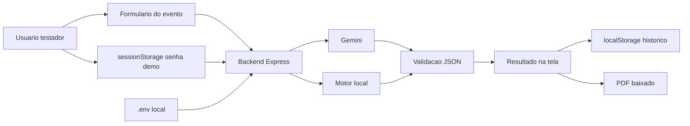
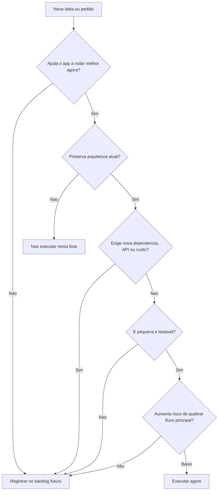
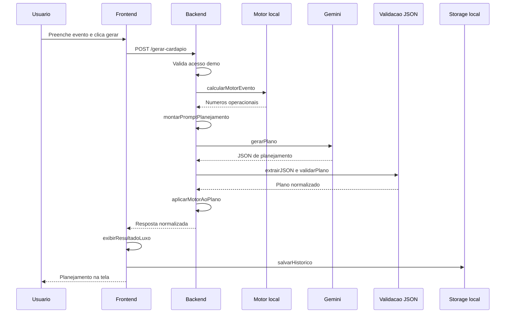
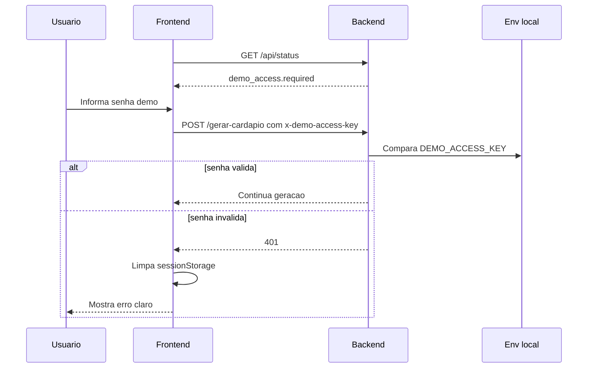
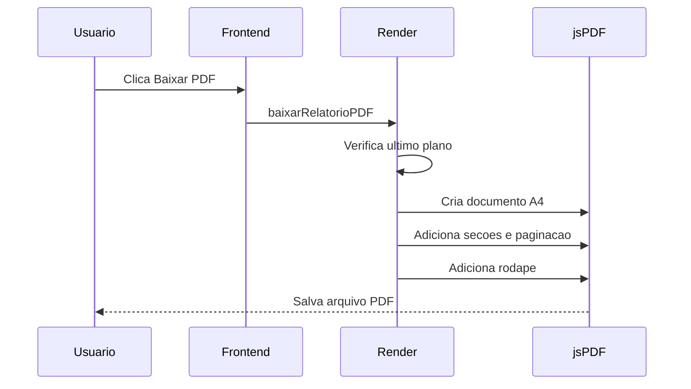
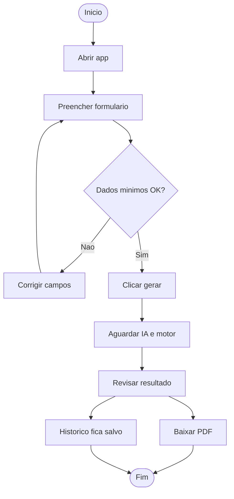
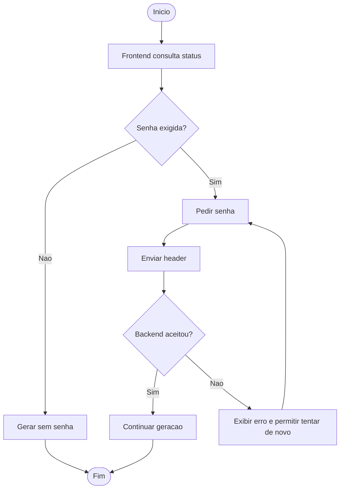
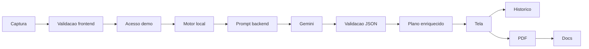

# Diagramas Complementares e Analise Tecnica - Chef IA Studio

<!-- CODEX:LER_SEMPRE
Ler este documento quando a tarefa pedir diagramas complementares, sequencia, atividade, viabilidade, SGPD/LGPD, mapeamento, fluxo logico ou analise tecnica de complementaridade.
Este arquivo complementa FLUXOS_DE_PROCESSO.md e ANALISE_REQUISITOS_ATORES_CASOS_USO.md.
-->

<!-- CODEX:LER_POR_PROCESSO
Antes de alterar geracao, acesso demo, PDF, historico, dados de usuario ou documentacao, conferir o diagrama correspondente neste arquivo.
Depois da mudanca, atualizar o diagrama e a tabela de status dos artefatos.
-->

<!-- CODEX:MANTER_EM_LINHA
Se este documento mudar por decisao de produto ou arquitetura, alinhar README.md, HANDOFF_PROXIMA_ATUALIZACAO.md, ROADMAP_ATUAL.md, FLUXOS_DE_PROCESSO.md e MATERIAL_APOIO_PROCESSOS_E_REQUISITOS.md quando aplicavel.
-->

<!-- CODEX:FAZER
Proximo uso recomendado: validar o modal de acesso demo no navegador e revisar o PDF real antes de teste externo.
Depois validar complementaridade com UC-03, UC-04, UC-06, Fluxo 2, Fluxo 3 e Fluxo 4.
-->

Documento de apoio para artefatos complementares que nao cabiam claramente nos documentos anteriores.

Ultima atualizacao: 2026-07-08

## Status dos artefatos pedidos

| Artefato | Status | Onde esta |
|---|---|---|
| Casos de uso | Existe | `ANALISE_REQUISITOS_ATORES_CASOS_USO.md`, secoes `UC-01` a `UC-10` |
| Diagrama de caso de uso | Existe | `ANALISE_REQUISITOS_ATORES_CASOS_USO.md`, secao "Diagrama de caso de uso" |
| Fluxos de processo | Existe | `FLUXOS_DE_PROCESSO.md` |
| Diagrama SGPD/LGPD de dados | Criado aqui | Secao "Diagrama SGPD/LGPD - fluxo de dados e protecao" |
| Diagrama de viabilidade | Criado aqui | Secao "Diagrama de viabilidade" |
| Diagramas de sequencia | Criado aqui | Secao "Diagramas de sequencia" |
| Diagramas de atividade | Criado aqui | Secao "Diagramas de atividade" |
| Caso de mapeamento | Criado aqui | Secao "Caso de mapeamento" |
| Definicao de fluxo logico | Criado aqui | Secao "Fluxo logico definido" |
| Analise tecnica de complementaridade | Criado aqui | Secao "Analise tecnica de complementaridade" |

Observacao: "SGPD" foi tratado aqui como fluxo operacional de protecao de dados e privacidade, com referencia pratica a LGPD. Este documento nao substitui avaliacao juridica.

## Diagrama SGPD/LGPD - fluxo de dados e protecao

Objetivo: mapear quais dados entram, onde passam, onde ficam e quais cuidados tecnicos existem hoje.

Dados tratados:

- Dados do evento: tipo, pessoas, duracao, refeicao, tema, restricoes, bebidas, orcamento e observacoes.
- Senha demo temporaria: enviada como header e guardada em `sessionStorage`.
- Historico local: evento e plano salvos no navegador do usuario.
- Chave Gemini: somente no `.env`, nunca no frontend.

Cuidados atuais:

- A chave da IA fica no backend.
- `.env` nao deve ser commitado.
- Acesso demo bloqueia `/gerar-cardapio` quando `DEMO_ACCESS_KEY` esta ativa.
- Historico fica local no navegador, sem banco em nuvem.

Pontos a validar antes de demo publica:

- Mensagem clara sobre dados salvos localmente.
- Botao simples para limpar historico.
- Limites de tamanho em campos livres.
- Politica simples de privacidade se houver link publico.

## Diagrama de viabilidade

Objetivo: decidir se uma melhoria entra agora, vai para backlog ou deve ser recusada no momento.

Leitura atual de viabilidade:

| Iniciativa | Viabilidade agora | Motivo |
|---|---|---|
| Validacao visual do modal demo | Alta | Modal ja implementado; falta confirmar experiencia no navegador real. |
| Validar PDF no navegador | Alta | Confirma entrega principal antes de teste externo. |
| Melhorar validacao de entrada | Media/alta | Reduz erro, mas deve ser feito pequeno. |
| Separar pitch do `index.html` | Media | Ajuda organizacao, mas nao bloqueia teste. |
| Adultos/criancas no motor | Media | Melhora calculo, mas mexe em motor e contrato. |
| Login/banco/pagamento | Baixa agora | Futuro, aumenta complexidade. |

## Diagramas de sequencia

### Sequencia 1 - Gerar planejamento

### Sequencia 2 - Acesso demo

### Sequencia 3 - Baixar PDF

## Diagramas de atividade

### Atividade 1 - Uso principal

### Atividade 2 - Resolver acesso demo

## Caso de mapeamento

Objetivo: ligar ator, caso de uso, processo, arquivo e validacao.

| Ator | Caso de uso | Processo | Arquivos | Validacao |
|---|---|---|---|---|
| Usuario testador | UC-02 Informar dados | Captura de formulario | `public/index.html`, `public/js/app.js` | VAL-03 |
| Usuario testador | UC-04 Validar acesso demo | Acesso demo | `public/js/app.js`, `server.js` | VAL-04, VAL-05 |
| Usuario testador | UC-03 Gerar planejamento | Geracao | `server.js`, `motor.service.js`, `gemini.service.js` | VAL-06, VAL-07 |
| Usuario testador | UC-05 Visualizar planejamento | Renderizacao | `public/js/render.js`, `public/js/utils.js` | VAL-08 |
| Usuario testador | UC-06 Baixar PDF | Exportacao PDF | `public/js/render.js` | VAL-10, VAL-11 |
| Usuario testador | UC-07/UC-08 Historico | Historico local | `public/js/storage.service.js`, `public/js/app.js` | VAL-09 |
| Assistente tecnico | UC-10 Atualizar docs | Documentacao | `docs/*.md`, `CLEANUP_AUDIT.md` | VAL-12 |

## Fluxo logico definido

Regra de ordem logica do sistema:

1. Capturar dados do evento.
2. Validar minimo no frontend.
3. Validar acesso demo no backend.
4. Calcular motor local.
5. Montar prompt no backend.
6. Chamar Gemini.
7. Extrair e validar JSON.
8. Aplicar motor ao plano.
9. Renderizar resultado.
10. Salvar historico local.
11. Exportar PDF se usuario pedir.
12. Atualizar documentacao se o fluxo mudou.

Representacao:

## Analise tecnica de complementaridade

| Componente | Funcao principal | Complementa | Nao deve substituir |
|---|---|---|---|
| Frontend | Captura dados, renderiza resultado e aciona PDF | Backend e storage local | Backend, motor ou prompt principal |
| Backend Express | Orquestra acesso, motor, prompt, IA e resposta | Frontend, motor e Gemini | Frontend visual |
| Motor local | Calcula numeros operacionais | Gemini | Criatividade textual da IA |
| Gemini | Gera plano criativo e detalhado | Motor local | Calculos operacionais deterministas |
| Validadores JSON | Protegem contrato da resposta | Gemini e renderizacao | Motor ou regras de negocio |
| Storage local | Mantem historico no navegador | Renderizacao e formulario | Banco futuro |
| PDF | Entrega compartilhavel | Resultado renderizado | Tela interativa |
| Documentacao viva | Guia retomada e decisoes | Codigo e testes | Verificacao real no app |

Conclusao tecnica:

- A arquitetura atual funciona por complementaridade entre motor local e IA.
- O motor local deve continuar sendo a fonte de numeros.
- O Gemini deve continuar gerando conteudo criativo e estruturado.
- O backend deve continuar protegendo chave, prompt e acesso demo.
- O frontend deve continuar focado em experiencia, historico e PDF.
- Toda mudanca relevante precisa manter docs vivos alinhados.

## Lacunas restantes

| Lacuna | Prioridade | Observacao |
|---|---|---|
| Validacao visual do modal demo | Alta | Confirmar foco, mensagens e responsividade. |
| Validacao visual real do PDF | Alta | Confirma a entrega antes de teste externo. |
| Limites formais de campos | Media | Ajuda fluxo logico e seguranca. |
| Privacidade para demo publica | Media | Necessaria antes de link publico amplo. |
| Diagrama formal em ferramenta externa | Baixa agora | Markdown/Mermaid basta para o repo nesta fase. |
