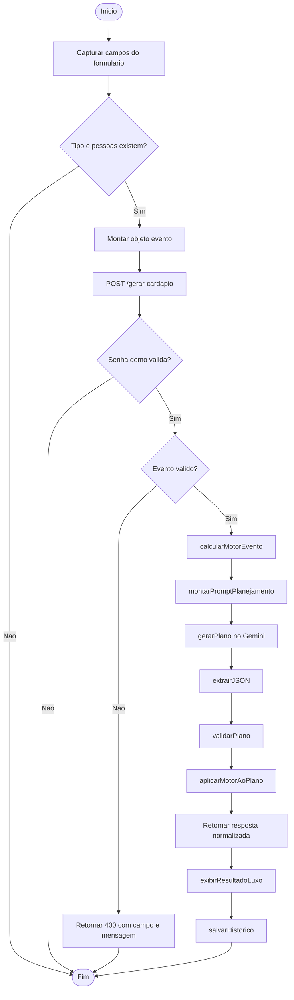
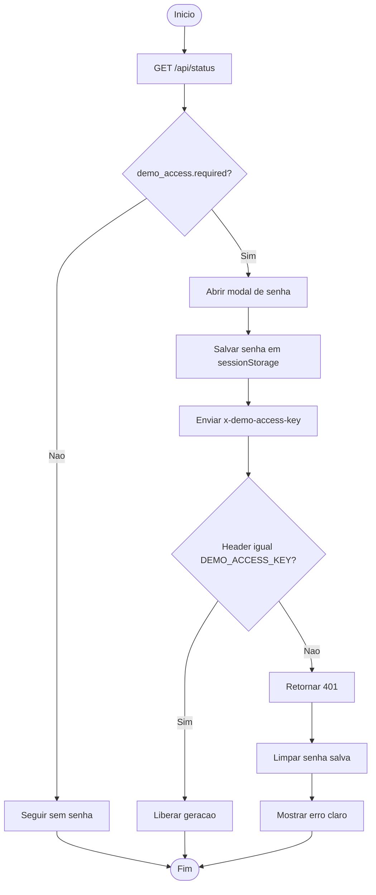
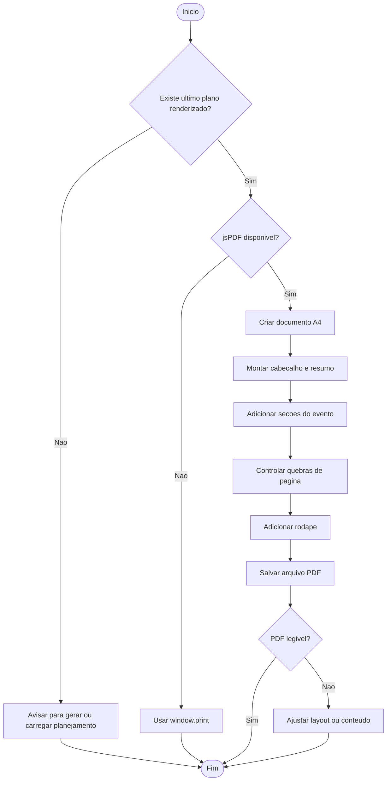
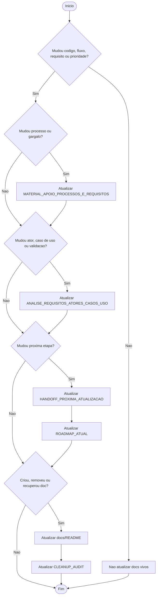
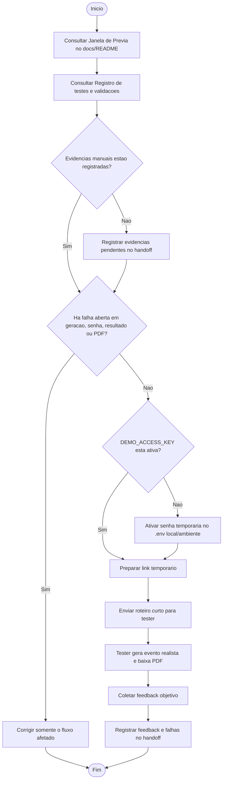

# Fluxos de Processo - Chef IA Studio

<!-- CODEX:LER_POR_PROCESSO
Ler este documento quando a tarefa envolver fluxo de uso, fluxo tecnico, acesso demo, geracao, PDF, historico ou documentacao.
Este arquivo existe para deixar os fluxos faceis de achar sem procurar dentro dos documentos maiores.
-->

<!-- CODEX:LER_POR_PROCESSO
Antes de alterar qualquer etapa do fluxo principal, conferir o Fluxo 1 e o Fluxo 2.
Antes de mexer em acesso demo, conferir o Fluxo 3.
Antes de mexer em PDF, conferir o Fluxo 4.
Antes de mexer em documentacao, conferir o Fluxo 5.
-->

<!-- CODEX:MANTER_EM_LINHA
Atualizar somente o fluxo alterado. Atualizar requisitos apenas se o comportamento esperado mudar.
Registrar no handoff se a mudanca afetar estado ou proximo passo.
-->

Documento dedicado aos fluxos do Chef IA Studio.

Ultima atualizacao: 2026-07-10

## Onde estavam antes

- BPMN simplificado: `docs/MATERIAL_APOIO_PROCESSOS_E_REQUISITOS.md`, secao "BPMN simplificado do fluxo atual".
- Fluxo geral de uso: `docs/ANALISE_REQUISITOS_ATORES_CASOS_USO.md`, secao "Fluxo geral de uso".
- Casos de uso: `docs/ANALISE_REQUISITOS_ATORES_CASOS_USO.md`, secoes `UC-01` a `UC-10`.

Este arquivo replica e organiza os fluxos principais para consulta rapida.

## Indice rapido

| Fluxo | Nome | Quando ler |
|---|---|---|
| Fluxo 1 | Macroprocesso ponta a ponta | Sempre que decidir proxima etapa |
| Fluxo 2 | Geracao de planejamento | Ao mexer em formulario, backend, motor, IA ou render |
| Fluxo 3 | Acesso demo | Ao mexer em `DEMO_ACCESS_KEY`, senha, modal ou teste externo |
| Fluxo 4 | Exportacao PDF | Ao mexer no botao PDF, layout do PDF ou resultado renderizado |
| Fluxo 5 | Atualizacao documental | Ao mudar codigo, fluxo, requisito, prioridade ou gargalo |
| Fluxo 6 | Demo controlada externa | Ao preparar link temporario, roteiro de tester ou Porta de Passagem |

## Proxima atualizacao curta

Objetivo: evitar repeticao de testes e deixar a trilha pronta para teste externo controlado.

1. Consultar `docs/HANDOFF_PROXIMA_ATUALIZACAO.md`, secao Registro de testes e validacoes.
2. Registrar evidencias dos testes manuais ja feitos pelo usuario para modal, geracao real e PDF.
3. Seguir o Fluxo 6 - Demo controlada externa se nao houver falha aberta.

Fora desta rodada:

- Separar pitch.
- Motor adultos/criancas.
- Login, banco, pagamento ou SaaS.
- Migracao de SDK Gemini.

## Fluxo 1 - Macroprocesso ponta a ponta

```mermaid
flowchart LR
    inicio([Inicio])
    abrir["Usuario abre app"]
    status["Frontend consulta status"]
    preencher["Usuario preenche evento"]
    acesso{"Demo exige senha?"}
    senha["Usuario informa senha"]
    gerar["Usuario solicita geracao"]
    backend["Backend recebe evento"]
    motor["Motor local calcula numeros"]
    prompt["Backend monta prompt"]
    ia["Gemini gera plano"]
    validar["Backend valida JSON"]
    aplicar["Backend aplica motor ao plano"]
    render["Frontend renderiza resultado"]
    historico["Frontend salva historico"]
    pdf["Usuario baixa PDF"]
    validarSaida{"Resultado e PDF OK?"}
    ajustar["Registrar ajuste"]
    docs["Atualizar docs vivos"]
    fim([Fim])

    inicio --> abrir
    abrir --> status
    status --> preencher
    preencher --> acesso
    acesso -->|"Sim"| senha
    acesso -->|"Nao"| gerar
    senha --> gerar
    gerar --> backend
    backend --> motor
    motor --> prompt
    prompt --> ia
    ia --> validar
    validar --> aplicar
    aplicar --> render
    render --> historico
    historico --> pdf
    pdf --> validarSaida
    validarSaida -->|"Sim"| docs
    validarSaida -->|"Nao"| ajustar
    ajustar --> docs
    docs --> fim
```



Entradas:

- Dados do evento.
- Senha demo, quando ativa.
- Configuracao Gemini no `.env`.

Saidas:

- Planejamento renderizado.
- Historico local.
- PDF.
- Documentacao atualizada quando houver mudanca relevante.

## Fluxo 2 - Geracao de planejamento



Arquivos principais:

- `public/js/app.js`
- `server.js`
- `src/services/planning/motor.service.js`
- `src/prompts/event.prompt.js`
- `src/services/ai/gemini.service.js`
- `src/utils/extract-json.js`
- `src/utils/validate-event.js`
- `src/utils/validate-plan.js`
- `public/js/render.js`
- `public/js/storage.service.js`

Validacoes ligadas:

- `VAL-03`
- `VAL-14`
- `VAL-05`
- `VAL-06`
- `VAL-07`
- `VAL-08`
- `VAL-09`

## Fluxo 3 - Acesso demo



Estado atual:

- O frontend usa modal de acesso demo com campo de senha, erro inline, cancelamento e foco automatico.
- A senha continua salva apenas em `sessionStorage` e enviada no header `x-demo-access-key`.

Validado nesta rodada:

- `GET /api/status` confirmou `demo_access.required: true`.
- `POST /gerar-cardapio` sem senha retornou 401.
- `POST /gerar-cardapio` com senha incorreta retornou 401.
- `POST /gerar-cardapio` com senha correta retornou 200, `ok: true`, `schema_ok: true`, `motor_local: true` e `prompt_backend: true`.
- Chrome headless carregou a pagina com o markup do modal.

Arquivos principais:

- `public/index.html`
- `public/js/app.js`
- `public/css/modules/form.css`
- `server.js`
- `.env.example`

Validacoes ligadas:

- `VAL-04`
- `VAL-05`
- `UC-04`

## Fluxo 4 - Exportacao PDF



Arquivos principais:

- `public/js/render.js`
- `public/index.html`

Validacoes ligadas:

- `VAL-10`
- `VAL-11`
- `UC-06`

## Fluxo 5 - Atualizacao documental



Regra:

- Documento novo vivo deve nascer com marcadores `CODEX:`.
- Mudanca em fluxo deve atualizar este arquivo e os documentos que ele referencia.

## Fluxo 6 - Demo controlada externa



Escopo do teste:

- Gerar um planejamento realista.
- Conferir modal de senha, resultado principal, historico e PDF.
- Reportar somente falhas ou confusoes do fluxo principal.

Fora do teste:

- Login, banco, pagamento ou SaaS.
- Motor adultos/criancas.
- Refatoracao do pitch.
- Agentes IA autonomos.
- Testes repetidos sem mudanca relacionada.

Entrada esperada do feedback:

- Tipo de evento.
- Numero de convidados.
- Navegador/dispositivo.
- Passo em que falhou ou confundiu.
- Print ou descricao curta, quando possivel.

## Comandos para encontrar fluxos

```bash
rg -n "Fluxo [0-9]|flowchart|BPMN|UC-" docs
```

```bash
rg -n "CODEX:" docs
```
