# Material de Apoio - Processos e Requisitos do Chef IA Studio

<!-- CODEX:LER_POR_PROCESSO
Ler somente a secao relacionada ao processo, gargalo ou requisito em analise.
Este e o mapa de processo: entradas, processos, saidas, stakeholders, gargalos e requisitos.
-->

<!-- CODEX:LER_POR_PROCESSO
Antes de alterar fluxo, acesso demo, PDF, motor local, validacao ou resultado, conferir o BPMN simplificado e os gateways D1-D7.
Depois da alteracao, atualizar Resumo vivo, Gargalos e requisitos afetados.
-->

<!-- CODEX:MANTER_EM_LINHA
Atualizar somente o processo, gargalo ou requisito alterado.
Registrar no handoff se a mudanca afetar estado ou proximo passo.
-->

Documento vivo para orientar decisoes, processos, gargalos e requisitos do Chef IA Studio.

Ultima atualizacao: 2026-07-09

## Mapa/GPS deste material

Use este documento depois do Mapa/GPS geral em `docs/README.md`.

Ordem interna de leitura:

1. `Resumo vivo`: estado real, decisoes de conducao e proximo tema recomendado.
2. `Escopo atual`: o que entra e o que fica fora agora.
3. `Decisao sobre agentes IA`: quando usar Unidades internas e quando reavaliar agentes.
4. `BPMN simplificado do fluxo atual`: visao de ponta a ponta.
5. `Entradas, processos e saidas`: contrato operacional do sistema.
6. `Definicoes de escolhas e gateways`: portas de passagem e riscos.
7. `Gargalos e riscos atuais`: o que bloqueia a proxima etapa.
8. `Documento de requisitos`: RF/RNF e regras de negocio.

Regra: se uma informacao deste material contradisser o handoff ou o roadmap, verificar a data e alinhar os documentos antes de executar.

## Resumo vivo

Estado atual:

- O app ja roda com frontend em `public/`, backend Express e Gemini via backend.
- O fluxo principal usa `POST /gerar-cardapio`, validacao backend do evento, motor local, prompt operacional inspirado pela Arquitetura Residencial de Prompts, contrato JSON restrito, renderizacao rica, historico local e exportacao PDF inicial/expandida.
- A protecao temporaria com `DEMO_ACCESS_KEY` esta ativa para teste controlado.
- O acesso demo agora usa modal/tela de senha no frontend, sem `prompt()` nativo do navegador.
- A rota real `/gerar-cardapio` ja foi validada com senha correta, retornando `ok`, `schema_ok`, `motor_local` e `prompt_backend`.
- Os fluxos de processo dedicados estao em `docs/FLUXOS_DE_PROCESSO.md`.
- A analise de requisitos, atores e casos de uso esta em `docs/ANALISE_REQUISITOS_ATORES_CASOS_USO.md`.
- Os diagramas complementares estao em `docs/DIAGRAMAS_COMPLEMENTARES_ANALISE_TECNICA.md`.
- Os padroes de qualidade, interface e priorizacao estao em `docs/PADROES_QUALIDADE_PRIORIZACAO.md`.
- O foco atual e uma atualizacao curta anti-repeticao: consultar o registro de testes, registrar evidencias dos testes manuais ja feitos e executar a Porta de Passagem da demo controlada se nao houver falha aberta.

Decisao de conducao:

- Preservar a arquitetura atual.
- Fazer mudancas pequenas, testaveis e documentadas.
- Tratar monetizacao, login, banco de dados, pagamentos e SaaS como futuro.
- Atualizar este documento sempre que mudar fluxo, requisito, gargalo ou stakeholder relevante.

Proximo tema recomendado:

- Consultar a Porta de Passagem da demo controlada em `docs/README.md`.
- Consultar o Registro de testes e validacoes em `docs/HANDOFF_PROXIMA_ATUALIZACAO.md` antes de rodar nova bateria.
- Seguir `docs/FLUXOS_DE_PROCESSO.md`, Fluxo 6 - Demo controlada externa.
- Registrar evidencias dos testes manuais ja feitos pelo usuario, especialmente modal, geracao real e PDF.

## Objetivo do material

Este arquivo existe para responder, antes de cada nova etapa:

- Qual e o inicio, meio e fim do processo?
- Quais entradas o sistema precisa?
- Quais processos transformam essas entradas?
- Quais saidas devem ser entregues?
- Onde existem decisoes, bifurcacoes e riscos?
- Quem participa ou e impactado?
- Quais gargalos impedem avanco?
- Quais requisitos precisam ser preservados?

Para detalhamento por ator, caso de uso, fluxo de uso e validacao, consulte `docs/ANALISE_REQUISITOS_ATORES_CASOS_USO.md`.

Para consultar apenas os fluxos de processo, use `docs/FLUXOS_DE_PROCESSO.md`.

Para diagramas de sequencia, atividade, viabilidade, SGPD/LGPD, mapeamento, fluxo logico e complementaridade tecnica, consulte `docs/DIAGRAMAS_COMPLEMENTARES_ANALISE_TECNICA.md`.

Para padroes de interface, convencoes, pontos fortes, oportunidades, ajustes iterativos e priorizacao, consulte `docs/PADROES_QUALIDADE_PRIORIZACAO.md`.

## Escopo atual

Dentro do escopo agora:

- App local/portfolio em HTML, CSS, JavaScript Vanilla, Node.js e Express.
- Gemini chamado somente pelo backend.
- Motor local para numeros operacionais.
- Historico em `localStorage`.
- PDF gerado no navegador com `jsPDF`.
- Teste externo controlado com `DEMO_ACCESS_KEY`.
- Documentacao enxuta em `docs/`.
- Unidades internas simples: motor local, prompt backend, validacao JSON, renderizacao, historico, acesso demo e PDF.

Fora do escopo agora:

- Reescrita em outro framework.
- Login multiusuario.
- Banco de dados em nuvem.
- Pagamentos.
- SaaS.
- Deploy complexo.
- APIs adicionais obrigatorias.
- Agentes IA autonomos ou multiagentes separados.

## Decisao sobre agentes IA

Pela Arquitetura Residencial de Prompts, agentes entram como Unidades quando papeis especializados reduzem confusao, retrabalho ou sobreposicao. No estado atual, o Chef IA Studio ainda nao precisa de agentes IA autonomos. A aplicacao esta melhor classificada como uma Residencia Completa, nao como Condominio multiagente.

Aplicacao pratica agora:

- Tratar motor local, prompt backend, validador, render, PDF e acesso demo como Unidades internas do sistema.
- Manter o Gemini como uma unica unidade criativa/estruturadora chamada pelo backend.
- Nao criar agentes separados para cardapio, compras, orcamento ou decoracao enquanto o fluxo principal, modal demo e PDF ainda estiverem em validacao.
- Reavaliar agentes no futuro apenas se houver biblioteca de fornecedores, pesquisa externa, precos locais, memoria persistente, revisao automatica de qualidade ou varias etapas independentes que precisem circular por Vias proprias.

Porta de passagem para criar agentes no futuro:

- Ha duas ou mais funcoes especializadas disputando responsabilidade?
- O fluxo atual gera retrabalho que uma Unidade separada reduziria?
- A nova Unidade teria entrada, saida, gatilho, limite e validacao claros?
- O Cômodo Central continuaria sendo planejar eventos, sem a arquitetura aparecer mais que a entrega?

## BPMN simplificado do fluxo atual

Este diagrama e um prototipo BPMN em formato Mermaid. Ele nao e BPMN XML formal, mas mapeia lanes, eventos, processos, gateways, entradas e saidas.

```mermaid
flowchart LR
    inicio([Inicio])
    fim([Fim])

    subgraph usuarioLane ["Lane: Usuario ou testador"]
        abreApp["Abre app local ou link temporario"]
        informaEvento["Preenche dados do evento"]
        senhaGateway{"Senha demo exigida?"}
        informaSenha["Informa senha demo"]
        revisaResultado["Revisa planejamento na tela"]
        pdfGateway{"PDF esta legivel?"}
        usaSaida["Usa, envia ou arquiva o planejamento"]
        reportaAjuste["Registra ajuste necessario"]
    end

    subgraph frontendLane ["Lane: Frontend public"]
        carregaTela["Carrega index, CSS e JS"]
        consultaStatus["Consulta GET /api/status"]
        montaEvento["Monta objeto evento"]
        enviaEvento["Envia POST /gerar-cardapio"]
        renderizaPlano["Renderiza resultado rico"]
        salvaHistorico["Salva historico local"]
        exportaPdf["Gera PDF via jsPDF"]
    end

    subgraph backendLane ["Lane: Backend Express"]
        validaSenha{"Header x-demo-access-key valido?"}
        validaEvento{"Evento respeita contrato e limites?"}
        retornaErro["Retorna 400 com campo e mensagem"]
        calculaMotor["Calcula motor local"]
        montaPrompt["Monta prompt backend"]
        chamaGemini["Chama servico Gemini"]
        validaJson["Extrai e valida JSON"]
        aplicaMotor["Aplica motor ao plano"]
        retornaPlano["Retorna resposta normalizada"]
    end

    subgraph iaLane ["Lane: Gemini"]
        geraPlano["Gera planejamento criativo"]
        retornaJson["Retorna JSON"]
    end

    subgraph docsLane ["Lane: Documentacao"]
        atualizaResumo["Atualiza resumo vivo"]
        atualizaHandoff["Atualiza handoff e roadmap"]
    end

    inicio --> abreApp
    abreApp --> carregaTela
    carregaTela --> consultaStatus
    consultaStatus --> informaEvento
    informaEvento --> senhaGateway
    senhaGateway -->|"Sim"| informaSenha
    senhaGateway -->|"Nao"| montaEvento
    informaSenha --> montaEvento
    montaEvento --> enviaEvento
    enviaEvento --> validaSenha
    validaSenha -->|"Nao"| reportaAjuste
    validaSenha -->|"Sim"| validaEvento
    validaEvento -->|"Nao"| retornaErro
    retornaErro --> reportaAjuste
    validaEvento -->|"Sim"| calculaMotor
    calculaMotor --> montaPrompt
    montaPrompt --> chamaGemini
    chamaGemini --> geraPlano
    geraPlano --> retornaJson
    retornaJson --> validaJson
    validaJson --> aplicaMotor
    aplicaMotor --> retornaPlano
    retornaPlano --> renderizaPlano
    renderizaPlano --> salvaHistorico
    salvaHistorico --> revisaResultado
    revisaResultado --> exportaPdf
    exportaPdf --> pdfGateway
    pdfGateway -->|"Sim"| usaSaida
    pdfGateway -->|"Nao"| reportaAjuste
    reportaAjuste --> atualizaResumo
    usaSaida --> atualizaResumo
    atualizaResumo --> atualizaHandoff
    atualizaHandoff --> fim
```

## Entradas, processos e saidas

| Tipo | Item | Origem | Destino | Observacao |
|---|---|---|---|---|
| Entrada | Tipo de evento | Usuario | `public/js/app.js` | Campo obrigatorio. |
| Entrada | Quantidade de pessoas | Usuario | `public/js/app.js` e motor local | Campo obrigatorio. |
| Entrada | Quantidade de criancas | Usuario | `public/js/app.js` e motor local | Opcional; adultos sao derivados do total. |
| Entrada | Pais, estado e cidade | Usuario | Evento e futura precificacao | Define recorte regional; sem catalogo, nenhum preco e exibido. |
| Entrada | Data do evento | Usuario | Evento e futura precificacao | Define contexto temporal e futura atualizacao da base. |
| Entrada | Duracao | Usuario | Motor local e prompt | Backend aceita inteiro de 1 a 24 ou usa o perfil do evento. |
| Entrada | Refeicao | Usuario | Motor local e prompt | Afeta quantidades e cardapio. |
| Entrada | Restricoes | Usuario | Prompt e plano | Afeta cardapio e alertas. |
| Entrada | Tema | Usuario | Prompt | Afeta decoracao, layout e linguagem. |
| Entrada | Orcamento desejado | Usuario | Prompt e orcamento | Ainda precisa normalizacao mais forte. |
| Entrada | Bebidas/alcool | Usuario | Motor local e prompt | Afeta bebidas, equipe e custo. |
| Entrada | Estilo | Usuario | Motor local e prompt | Afeta perfil, custo e acabamento. |
| Entrada | Observacoes livres | Usuario | Prompt | Complementa detalhes do evento. |
| Entrada | `DEMO_ACCESS_KEY` | `.env` e usuario/testador | Backend | Protecao temporaria de teste. |
| Processo | Captura do formulario | Frontend | `evento` | Mantem IDs atuais do HTML. |
| Processo | Validacao de acesso demo | Backend | Decisao 401 ou continua | Evita uso externo sem senha. |
| Processo | Motor local | Backend | Plano enriquecido | Nao deve ser removido. |
| Processo | Prompt backend | Backend | Gemini | Prompt nao deve voltar ao frontend; metodologia organiza contexto, foco, limites e entrega sem aparecer no resultado. |
| Processo | Extracao/normalizacao/validacao JSON | Backend | Resposta normalizada | Evita quebrar a interface e estabiliza campos usados pela tela e PDF. |
| Processo | Renderizacao | Frontend | Tela do usuario | Usa `render.js`. |
| Processo | Historico local | Frontend | `localStorage` | Mantem planejamentos recentes. |
| Processo | Exportacao PDF | Frontend | Arquivo PDF | Consultar registro antes de repetir validacao visual. |
| Saida | Planejamento renderizado | Frontend | Usuario | Resultado principal. |
| Saida | PDF | Frontend | Usuario/testador | Entrega compartilhavel. |
| Saida | Historico local | Frontend | Usuario | Reuso de planejamentos. |
| Saida | Handoff atualizado | Documentacao | Proxima rodada | Evita perda de contexto. |

## Definicoes de escolhas e gateways

| Gateway | Pergunta | Sim | Nao | Risco |
|---|---|---|---|---|
| D1 | O teste externo exige senha? | Abrir modal de senha demo e enviar header. | Gerar localmente sem senha. | Antes de repetir teste do modal, consultar registro no handoff. |
| D2 | Tipo, pessoas, duracao e textos respeitam os limites? | Calcular motor e montar prompt. | Retornar 400 com campo e mensagem. | Validado tambem por testes automatizados. |
| D3 | Senha demo e valida? | Continuar geracao. | Retornar 401 e limpar senha salva. | Mensagem precisa ficar clara na UI. |
| D4 | Gemini esta configurado? | Chamar modelo. | Retornar fallback controlado. | Falha de `.env` ou chave invalida. |
| D5 | JSON veio valido? | Validar e renderizar. | Usar fallback e avisar. | Plano pode ficar generico. |
| D6 | PDF ficou legivel? | Liberar teste externo. | Ajustar quebras, secoes e densidade. | PDF e gargalo de confianca. |
| D7 | Mudanca afeta fluxo principal? | Atualizar este doc, handoff e roadmap. | Registrar somente se for decisao relevante. | Documentacao pode ficar desatualizada. |

## Mapeamento de stakeholders

| Stakeholder | Papel | Interesse principal | Necessidade atual | Nivel de impacto |
|---|---|---|---|---|
| Dono do projeto | Produto, decisao e validacao | Ter portfolio/MVP local confiavel | Clareza de proximo passo e pouco desperdicio | Alto |
| Usuario testador | Usa o app e gera plano | Receber planejamento util e PDF legivel | Fluxo simples, senha clara e resultado confiavel | Alto |
| Organizador de eventos | Usuario potencial futuro | Economizar tempo de planejamento | Numeros operacionais, compras e cronograma | Alto |
| Desenvolvedor/IA assistente | Implementacao e manutencao | Preservar arquitetura e resolver gargalos | Docs atuais e escopo bem definido | Alto |
| Gemini/API | Provedor externo | Gerar conteudo estruturado | Prompt claro, chave valida e fallback | Medio |
| GitHub/repositorio | Controle de versao | Manter codigo e historico seguros | `.env` fora do commit e docs coerentes | Medio |
| Amigo/convidado de teste | Feedback externo controlado | Testar sem quebrar ou expor chave | Link temporario e `DEMO_ACCESS_KEY` | Medio |
| Futuro cliente | Possivel usuario pago no futuro | Confianca, qualidade e previsibilidade | Ainda fora do escopo de monetizacao | Baixo agora |

## Processos identificados

### P1 - Retomada de contexto

Entrada:

- `docs/HANDOFF_PROXIMA_ATUALIZACAO.md`
- `docs/ROADMAP_ATUAL.md`
- `docs/MATERIAL_APOIO_PROCESSOS_E_REQUISITOS.md`

Processo:

- Confirmar estado real.
- Identificar proximo gargalo.
- Evitar reabrir tarefas ja concluidas.

Saida:

- Decisao minima de trabalho.

### P2 - Geracao de planejamento

Entrada:

- Dados do evento.
- Senha demo, quando ativa.

Processo:

- Frontend monta `evento`.
- Backend valida acesso.
- Motor local calcula numeros.
- Prompt backend separa dados do evento, motor local, limites, modulos e formato final.
- Gemini gera plano.
- Backend extrai, normaliza, valida JSON e aplica motor.

Saida:

- Planejamento renderizado.
- Historico local atualizado.

### P3 - Exportacao PDF

Entrada:

- Ultimo plano renderizado.
- Dados do evento e motor local.

Processo:

- `render.js` monta documento com `jsPDF`.
- Inclui resumo, evento, cardapio, compras, servico, utensilios, cronograma, equipe, checklist e orcamento.

Saida:

- PDF baixado.

### P4 - Teste externo controlado

Entrada:

- App rodando.
- `DEMO_ACCESS_KEY` definido.
- Link temporario de teste.

Processo:

- Testador abre link.
- Informa senha.
- Gera planejamento.
- Baixa PDF.
- Reporta falhas.

Saida:

- Lista de ajustes validada por uso real.

### P5 - Atualizacao documental

Entrada:

- Mudanca de codigo, fluxo, requisito ou decisao.

Processo:

- Atualizar este documento se o processo mudou.
- Atualizar handoff se afeta a proxima rodada.
- Atualizar roadmap se muda prioridade.

Saida:

- Proxima sessao com contexto correto.

## Gargalos e riscos atuais

| Gargalo | Onde aparece | Impacto | Acao recomendada |
|---|---|---|---|
| Evidencia visual do modal demo | `public/index.html`, `public/js/app.js`, `public/css/modules/form.css` | Precisa ficar registrada para nao repetir teste manual | Registrar resultado no handoff antes de nova validacao. |
| Validacao de entrada simples | Frontend/backend | Pode enviar dados fracos ou inconsistentes | Melhorar mensagens e limites por campo. |
| Evidencia visual do PDF real | `public/js/render.js` | Entrega final depende de registro claro do que ja foi revisado | Registrar resultado no handoff; repetir so se houver mudanca ou falha. |
| Mobile com densidade alta | CSS/layout | Testador pode achar pesado no celular | Ajustar nav, titulo e resultado mobile. |
| Dependencia da resposta Gemini | `gemini.service.js`, `event.prompt.js`, `validate-plan.js` | Latencia, erro de chave ou JSON ruim | Manter prompt estruturado, fallback, normalizacao e logs claros. |
| Documentos historicos contraditorios | `docs/` | Pode induzir proximo passo antigo | Sempre consultar handoff e roadmap antes do plano mestre. |
| `localStorage` apenas local | Frontend | Historico nao acompanha outro navegador/dispositivo | Aceitar no MVP; nuvem fica para futuro. |
| Sem metricas de uso | Backend/frontend | Dificulta medir teste externo | Registrar observacoes manualmente por enquanto. |

## Documento de requisitos

### Requisitos funcionais

| ID | Requisito | Status | Criterio de aceite |
|---|---|---|---|
| RF-01 | O app deve servir frontend por Express em `public/`. | Implementado | `npm start` abre `http://localhost:3000`. |
| RF-02 | O app deve expor `GET /api/status`. | Implementado | Retorna `ok`, status da IA, demo e motor local. |
| RF-03 | O app deve gerar planejamento por `POST /gerar-cardapio`. | Implementado reforcado | Aceita evento validado e retorna `{ ok, provider, plano, meta }`; prompt arbitrario do cliente e rejeitado. |
| RF-04 | A chave da IA deve ficar somente no backend. | Implementado | Nenhuma chamada direta de IA no frontend. |
| RF-05 | O prompt principal deve ficar no backend. | Implementado reforcado | `src/prompts/event.prompt.js` usa secoes operacionais proporcionais e contrato explicito. |
| RF-06 | O motor local deve calcular numeros operacionais. | Implementado inicial | Plano contem `motor_logistica`. |
| RF-07 | A resposta da IA deve ser extraida, normalizada e validada. | Implementado reforcado | Campos essenciais sao exigidos, campos externos descartados e falha gera fallback controlado. |
| RF-08 | O resultado deve renderizar secoes completas. | Implementado em melhoria | Tela mostra cardapio, compras, cronograma, equipe, orcamento e extras. |
| RF-09 | O app deve salvar historico local. | Implementado | Planejamento aparece em recentes. |
| RF-10 | O app deve carregar planejamento do historico. | Implementado | Formulario e resultado sao preenchidos. |
| RF-11 | O app deve exportar PDF. | Implementado em melhoria | Botao baixa PDF com secoes principais. |
| RF-12 | O teste externo deve poder exigir senha temporaria. | Implementado | Modal pede senha; sem senha ou senha incorreta, `/gerar-cardapio` retorna 401. |
| RF-13 | A UI deve comunicar erros de forma clara. | Implementado em melhoria | Usuario entende senha invalida, servidor fora ou falha da IA. |
| RF-14 | O PDF deve ser legivel em eventos realistas. | Pendente validacao | Quebras de pagina e textos ficam legiveis. |
| RF-15 | O motor deve separar adultos e criancas. | Implementado inicial | Consumo usa fator infantil; equipe, espaco e mesa preservam o total. |
| RF-16 | O backend deve validar o evento antes do motor e da IA. | Implementado | Limites invalidos retornam HTTP 400 com campo e mensagem; corpo JSON e limitado a 20 KB. |
| RF-17 | Todo valor financeiro exibido deve ter origem rastreavel. | Em implementacao | Regiao, moeda, fonte e data-base acompanham o preco; sem catalogo, mostrar `A cotar`. |

### Requisitos nao funcionais

| ID | Requisito | Status | Criterio de aceite |
|---|---|---|---|
| RNF-01 | Preservar arquitetura simples atual. | Ativo | Sem reescrita para outro framework. |
| RNF-02 | Proteger segredos. | Ativo | `.env` nao e commitado. |
| RNF-03 | Manter mudancas pequenas e testaveis. | Ativo | Cada etapa tem validacao simples. |
| RNF-04 | Evitar dependencias novas sem necessidade. | Ativo | Nova biblioteca exige justificativa. |
| RNF-05 | Responder em tempo aceitavel no teste local. | Em observacao | Geracao real deve ser monitorada. |
| RNF-06 | Funcionar em desktop e mobile. | Em melhoria | Primeira dobra e resultado nao quebram. |
| RNF-07 | Documentar decisoes importantes. | Ativo | Handoff, roadmap e este documento ficam alinhados. |
| RNF-08 | Evitar promessa de SaaS antes da base. | Ativo | Monetizacao permanece no backlog futuro. |

### Regras de negocio

- Motor local e fonte dos numeros operacionais.
- IA complementa com criatividade, cardapio, decoracao, roteiro e explicacoes.
- A Arquitetura Residencial de Prompts orienta a hierarquia do prompt, mas o runtime usa rotulos operacionais e nunca devolve a metafora ao usuario.
- Motor local e aplicado pelo backend; o Gemini nao deve devolver nem controlar `motor_logistica`.
- `pessoas` e o total do evento; `criancas` e opcional e adultos sao derivados. Criancas usam fator inicial de consumo de 60%.
- IA nao define preco. Motor calcula quantidades; catalogo fornece valores; indice oficial apenas atualiza uma base existente.
- Banco de dados entra somente quando JSON/CSV nao atender regioes, historico, fornecedores ou administracao.
- Teste externo deve ser curto, controlado e protegido por senha temporaria.
- Historico em nuvem, login e pagamentos so entram depois de estabilidade local e demo publica simples.
- O plano mestre recuperado e referencia historica; o estado atual vem do handoff e roadmap.

## Backlog futuro controlado

| Item | Motivo | Fase recomendada |
|---|---|---|
| Separar pitch do `index.html` | Reduz complexidade do arquivo principal | Depois de validar PDF. |
| Secoes recolhiveis | Melhora leitura de resultado grande | Refinamento de UI. |
| Refinar validacao backend conforme feedback | Ajustar limites e regras de negocio com evidencia real | Depois do primeiro ciclo de demo. |
| Persistencia em nuvem | Historico multi-dispositivo | Futuro MVP publico. |
| Login e limite de uso | Controle de abuso | Futuro produto publico. |
| Pagamentos | Monetizacao | Futuro distante. |

## Como atualizar este documento

Atualize o resumo vivo quando:

- Um processo mudar.
- Um requisito for concluido ou rebaixado.
- Um gargalo for resolvido ou aparecer.
- Um stakeholder novo passar a influenciar decisoes.
- Uma decisao de arquitetura mudar.

Checklist rapido de atualizacao:

- O BPMN ainda representa o fluxo real?
- Entradas e saidas continuam corretas?
- Algum gateway mudou?
- Algum gargalo foi resolvido?
- Requisitos marcados como pendentes continuam pendentes?
- Handoff e roadmap precisam ser ajustados tambem?
