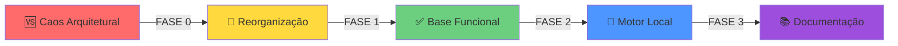
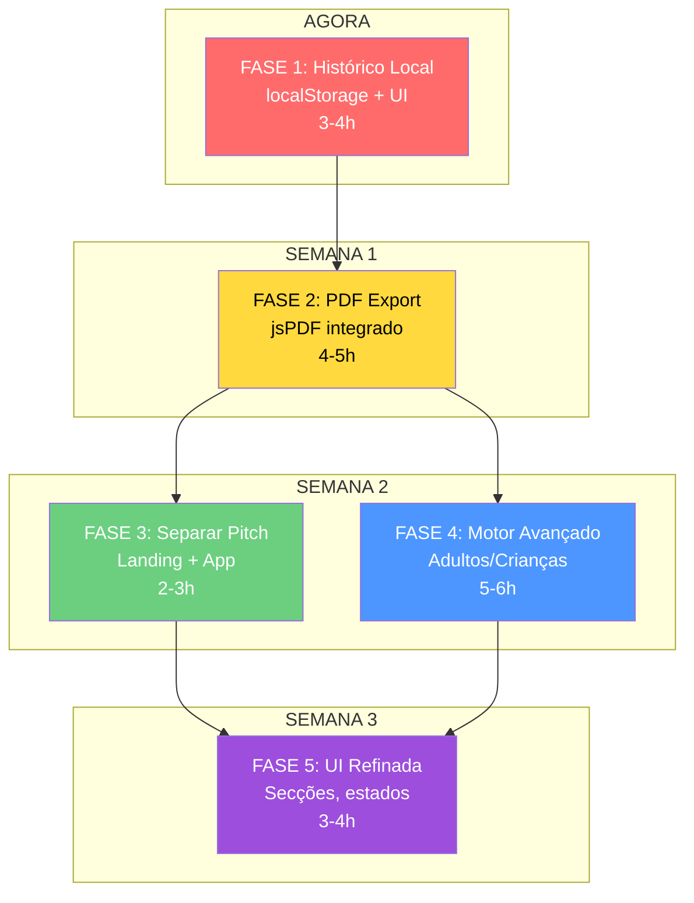

# 🎯 Resumo Visual — Chef IA Studio

**Última atualização:** 2026-07-02

---

## ✅ O que foi Feito (Até Agora)



### Estabilização ✅

| Componente | Status | O que funciona |
|-----------|--------|-----------------|
| **Frontend** | ✅ | Formulário integrado, renderização de resultado |
| **Backend** | ✅ | Express rodando, endpoints respondendo |
| **IA** | ✅ | Gemini integrado via backend |
| **Validação** | ✅ | JSON robusto, fallback amigável |
| **Motor Local** | ✅ | Cálculos de eventos funcionando |
| **Estrutura** | ✅ | public/, src/, legacy/, docs/ organizados |
| **Documentação** | ✅ | Histórico completo em docs/ |

---

## 📍 Próximas Fases (Roadmap)



---

## 📊 Estado Técnico Atual

### Arquitetura

```
┌─────────────────────────────────────────────────────┐
│          🌐 FRONTEND (Vanilla JS)                   │
├─────────────────────────────────────────────────────┤
│  public/index.html (formulário + pitch)             │
│  public/js/app.js (bootstrap, form, fetch)          │
│  public/js/render.js (renderização resultado)       │
│  public/js/utils.js (helpers, validação)            │
│  public/css/ (modularizado por tema)                │
└─────────────────────────────────────────────────────┘
                        ↕
          POST /gerar-cardapio
                        ↕
┌─────────────────────────────────────────────────────┐
│          🖥️ BACKEND (Express.js)                    │
├─────────────────────────────────────────────────────┤
│  server.js (rotas, CORS)                            │
│  src/services/ai/gemini.service.js (IA)            │
│  src/services/planning/motor.service.js (cálculos) │
│  src/prompts/event.prompt.js (prompt)              │
│  src/utils/extract-json.js (parse)                 │
│  src/utils/validate-plan.js (validação)            │
└─────────────────────────────────────────────────────┘
                        ↕
┌─────────────────────────────────────────────────────┐
│          🤖 PROVIDER IA (Google Gemini)             │
├─────────────────────────────────────────────────────┤
│  Modelo: gemini-pro ou gemini-flash-latest          │
│  SDK: @google/generative-ai v0.24.1                 │
│  Chave: GEMINI_API_KEY via .env                     │
└─────────────────────────────────────────────────────┘
```

### Fluxo de Dados

```
Usuário preenche formulário
        ↓
Form validação JS
        ↓
POST /gerar-cardapio
        ↓
Backend monta evento + motor
        ↓
Prompt + contexto do motor
        ↓
Gemini gera JSON
        ↓
Extract JSON + validação
        ↓
Motor calcula + enriquece
        ↓
Response { ok, provider, plano }
        ↓
Frontend renderiza resultado
        ↓
Usuário vê planejamento completo
```

---

## 🔍 O que Cada Fase Agrega

### FASE 1: Histórico Local ⏱️ 3-4h

**Por que?**
- Usuário volta múltiplas vezes
- localStorage persiste sem servidor
- Diferencia do usuário "uma tentativa" vs "usuário real"

**O que precisa:**
- `src/utils/storage.service.js` (salvar/carregar/deletar)
- Seção de histórico no HTML
- Renderizador de cards do histórico
- Integração no fluxo de geração

**Resultado visual:**
```
┌────────────────────────────────────┐
│ Seus Planejamentos Recentes        │
├────────────────────────────────────┤
│ ▢ Casamento • 150 pessoas         │
│   Criado: há 2 dias               │
│   [Carregar] [Excluir]            │
├────────────────────────────────────┤
│ ▢ Coorporativo • 50 pessoas       │
│   Criado: ontem                   │
│   [Carregar] [Excluir]            │
├────────────────────────────────────┤
│ ▢ Aniversário • 30 pessoas        │
│   Criado: há 1 hora               │
│   [Carregar] [Excluir]            │
└────────────────────────────────────┘
```

---

### FASE 2: Exportação PDF ⏱️ 4-5h

**Por que?**
- PDF é "documento oficial"
- Cliente pode imprimir/compartilhar
- Diferencia ferramenta web de profissional

**O que precisa:**
- `npm install jspdf html2canvas`
- `src/utils/pdf.builder.js` (gerar PDF estruturado)
- Endpoint `POST /exportar-pdf`
- Botão "Exportar PDF" no resultado

**Resultado visual:**
```
📄 cardapio_1688765432.pdf

┌─────────────────────────────┐
│ PLANEJAMENTO DE EVENTO      │
│ Casamento • 150 pessoas     │
│ 14/07/2026                  │
├─────────────────────────────┤
│ RESUMO EXECUTIVO            │
│ Para 150 pessoas...         │
├─────────────────────────────┤
│ LISTA DE COMPRAS            │
│ Proteínas: 15kg             │
│ Vegetais: 20kg              │
│ ...                         │
├─────────────────────────────┤
│ ORÇAMENTO TOTAL: R$ 5.250   │
└─────────────────────────────┘
```

---

### FASE 3: Separar Apresentação ⏱️ 2-3h

**Por que?**
- Landing page para SEO
- App em `/app.html` é mais claro
- Primeiro impressão profissional

**O que precisa:**
- `public/index.html` → landing page
- `public/app.html` → aplicação (cópia do original)
- `public/js/index.js` → scripts da landing
- Atualizar rotas no Express

**Resultado visual:**
```
http://localhost:3000/  →  LANDING PAGE
  Hero + Features + CTA
  
http://localhost:3000/app  →  APLICAÇÃO
  Formulário + Histórico + Resultado
```

---

### FASE 4: Motor Avançado ⏱️ 5-6h

**Por que?**
- Cálculos adultos/crianças são fundamentais
- Interface avançada = ferramenta profissional
- Multiplicadores por tipo de refeição aumentam precisão

**O que precisa:**
- Novos campos no formulário (adultos, crianças, duração)
- `calcularMotorAvancado()` em motor.service.js
- `calcularUtensílios()` detalhado
- Atualizar prompt com novos contextos

**Resultado visual:**
```
Formulário expandido:
├─ Tipo de evento
├─ Adultos: 120
├─ Crianças: 30
├─ Duração: 5 horas
├─ Tipo de refeição: Almoço
├─ Formalidade: Semiformal
└─ % com álcool: 80%

Motor calcula:
├─ Alimentos: 27.3kg (18kg adultos, 4.5kg crianças)
├─ Bebidas: 52L (35L adultos, 8L crianças)
├─ Talheres: 180 (diferentes por formalidade)
├─ Copos: 300 (água + bebida)
├─ Pratos: 300
├─ Guardanapos: 450
└─ Equipe: 5 pessoas + 3 chefs
```

---

### FASE 5: UI Refinada ⏱️ 3-4h

**Por que?**
- Interface polida = confiança
- Secções recolhíveis = melhor UX
- Estados visuais = menos confusão

**O que precisa:**
- CSS para recolher/expandir secções
- Quick stats topo (pessoas, orçamento, equipe, pratos)
- Estados: loading, erro, vazio
- Botões: PDF, Compartilhar, Novo

**Resultado visual:**
```
┌─────────────────────────────────────┐
│ 👥 150    💰 R$ 5.250   👨‍⚖️ 5    🍽️ 8   │
├─────────────────────────────────────┤
│ ▼ 📋 Resumo Executivo               │ ← ABERTO
│   Para 150 pessoas em almoço...     │
├─────────────────────────────────────┤
│ ▶ 🛒 Compras                        │ ← RECOLHIDO
├─────────────────────────────────────┤
│ ▶ ⏰ Cronograma                     │ ← RECOLHIDO
├─────────────────────────────────────┤
│ ▶ 💰 Orçamento                      │ ← RECOLHIDO
├─────────────────────────────────────┤
│ ▶ 👨‍⚖️ Equipe                        │ ← RECOLHIDO
├─────────────────────────────────────┤
│ [📥 PDF]  [📤 Compartilhar]  [✨ Novo] │
└─────────────────────────────────────┘
```

---

## 💾 Armazenamento de Dados

### localStorage (FASE 1)
```javascript
{
  "historico": [
    {
      "id": "evento_1688765432",
      "data_criacao": "2026-07-02T10:30:00Z",
      "tipo": "Casamento",
      "pessoas": 150,
      "evento": { /* dados completos */ },
      "plano": { /* resultado da IA */ }
    },
    ...
  ]
}
```
**Limite:** ~5-10MB por domínio  
**Persistência:** Indefinida (até limpeza do navegador)

### Firebase/Supabase (Futuro)
Para sincronizar histórico na nuvem e acessar de múltiplos dispositivos.

---

## 🧪 Testes Recomendados

### Por Fase

**FASE 1:**
- [ ] Gerar evento → verificar salvo em localStorage
- [ ] Recarregar página → histórico persiste
- [ ] Clicar "Carregar" → formulário + resultado reaparecem
- [ ] Clicar "Excluir" → remove da lista

**FASE 2:**
- [ ] Clicar "Exportar PDF" → download funciona
- [ ] Abrir PDF → layout legível
- [ ] Imprimir PDF → sem quebras de linha

**FASE 3:**
- [ ] `/` → Landing page abre
- [ ] Clicar "Começar" → redireciona `/app`
- [ ] `/app` → Aplicação funciona
- [ ] Botão "Voltar" em `/app` → retorna para `/`

**FASE 4:**
- [ ] Preencher adultos/crianças → cálculos diferentes
- [ ] Alterar duração → equipe muda
- [ ] Tipo de refeição → cardápio diferente
- [ ] Gemini recebe contexto correto

**FASE 5:**
- [ ] Clicar secção → expande/recolhe
- [ ] Animação suave
- [ ] Estados (loading, erro) aparecem
- [ ] Botões funcionam

---

## 📈 Métricas de Sucesso

| Métrica | Antes | Depois | Meta |
|---------|-------|--------|------|
| Tempo para gerar | - | <5s | <3s |
| Taxa de reuso | 0% | ~40% | >60% |
| Documentos exportados | 0 | Crescente | >50% |
| Erro sem recuperação | 15% | <2% | 0% |
| Tempo na app | 5 min | 10 min | 15 min |
| Conversão (sign-up) | - | - | >30% |

---

## 🚨 Riscos e Mitigação

| Risco | Probabilidade | Impacto | Mitigação |
|-------|--------------|--------|-----------|
| localStorage cheio | Baixa | Alto | Limitar a 50 entradas |
| PDF muito lento | Média | Médio | Gerar no backend |
| Gemini timeout | Baixa | Alto | Fallback com template |
| Cálculos imprecisos | Média | Alto | Testar com dados reais |
| Compatibilidade navegador | Baixa | Médio | Testar em Chrome/Firefox |

---

## 🎓 Stack Técnico

### Frontend
- **HTML5:** Semântica moderna
- **CSS3:** Grid, Flexbox, Animações
- **JavaScript:** Vanilla (sem frameworks)
- **Librarias:** GSAP (animações), Swiper (carrossel), jsPDF (PDF)

### Backend
- **Node.js:** v18+ (LTS)
- **Express:** Roteamento e middlewares
- **dotenv:** Variáveis de ambiente

### IA
- **Gemini API:** Via @google/generative-ai v0.24.1
- **Modelo:** gemini-pro ou gemini-flash-latest

### DevOps
- **Git:** Versionamento (legacy em .gitignore)
- **npm:** Gerenciador de pacotes
- **Port:** 3000 (configurável via .env)

---

## 📞 Comandos Úteis

### Iniciar
```bash
cd app-cardapio-ia
npm start
# Abrir http://localhost:3000
```

### Testar
```bash
# Sintaxe
node --check server.js
node --check src/services/ai/gemini.service.js

# Status
curl http://localhost:3000/api/status

# POST teste
curl -X POST http://localhost:3000/gerar-cardapio \
  -H "Content-Type: application/json" \
  -d '{"tipo":"Almoço","pessoas":50}'
```

### Logs
```bash
# Simular erro no browser
console.log('debug:', window.eventoAtual);
console.log('plano:', window.planoAtual);

# Verificar localStorage
localStorage.getItem('historico')
```

### Limpeza
```bash
# Limpar node_modules
rm -rf node_modules package-lock.json && npm install

# Limpar localStorage (no console do browser)
localStorage.clear()
```

---

## 📚 Documentação Relacionada

- [HANDOFF_PROXIMA_ATUALIZACAO.md](HANDOFF_PROXIMA_ATUALIZACAO.md) — Contexto técnico completo
- [planoCompletoChefia.md](planoCompletoChefia.md) — Decisões arquiteturais
- [STATUS.md](STATUS.md) — Estado após Fase 2
- [ROADMAP_ATUAL.md](ROADMAP_ATUAL.md) — Roadmap executado
- [CLEANUP_AUDIT.md](../CLEANUP_AUDIT.md) — O que foi removido/movido

---

## ✋ Chamada para Ação

**Próximo passo:** Começar FASE 1 (Histórico Local)

**Tempo:** 3-4 horas  
**Impacto:** 🔴 Alto (usuários voltam mais)  
**Dificuldade:** 🟢 Baixa (localStorage é simples)

### Para começar:

1. Abra o arquivo [PLANO_CONTINUACAO.md](PLANO_CONTINUACAO.md)
2. Siga as tarefas da **FASE 1**
3. Teste cada passo
4. Quando terminar, passe para FASE 2

---

*Documento de visão geral — 2026-07-02*  
*Detalhes técnicos em PLANO_CONTINUACAO.md*
