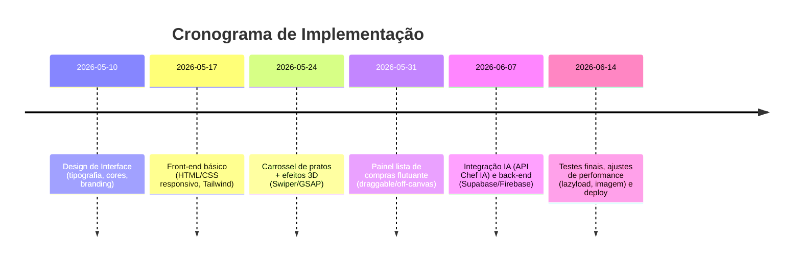

# Resumo Executivo  
Este relatório detalha como transformar o app “Chef IA – Planejador de Eventos” (HTML/CSS/JS simples) em um front-end rico e interativo, conectado a serviços na nuvem. Propomos melhorar tipografia (sombreamento, reflexos), cores/degradês polidos e ilustrações de alimentos (SVGs ou fotos de bancos livres). Para as interações, sugerimos efeitos 3D nas imagens de pratos (usando transformações CSS *perspective/rotate3d* e/ou animações GSAP【15†L139-L145】), transições suaves e um layout responsivo. Implementaremos um **carrossel de pratos** (com bibliotecas como Swiper ou Splide) e um **painel flutuante de lista de compras** (draggable ou off-canvas) onde pratos podem ser adicionados/remo­­v­­idos animadamente. Para ícones e ilustrações, recomendamos fontes como Font Awesome, Heroicons e repositórios de imagens gratuitos (Unsplash/Pexels/Pixabay)【30†L87-L95】【26†L60-L68】. No back-end, sugerimos usar *serverless* (Vercel/Netlify Functions, Cloudflare Workers) e bancos de dados/cloud storage gratuitos (Supabase, Firebase). Também listamos conectores para autenticação (Auth0, Supabase Auth), pagamentos e APIs de IA (OpenAI, Vertex AI). A seguir detalhamos frameworks, bibliotecas e serviços recomendados, código de exemplo e diagramas de implementação. 

【5†embed_image】*Figura: Exemplo de interface de app de receitas em smartphone, ilustrando estilo visual moderno.*  

## Bibliotecas CSS/Frameworks UI  
- **Tailwind CSS**: Framework utilitário popular, excelente para layouts responsivos e customização fina. Permite classes utilitárias (*bg-blue-500*, *px-4*, etc.) que aceleram o design sem CSS custom pesado【42†L149-L157】. *Prós:* flexibilidade total, controle pixel a pixel, purga de CSS não usado. *Contras:* curva de aprendizado inicial para lembrar classes e verbosidade no HTML. Licença MIT (gratuito). Integração fácil (CDN ou NPM). Sem documentação oficial em PT, mas há tutoriais online.  
- **Bootstrap**: Framework clássico de componentes pré-prontos (botões, modais, grid)【42†L114-L122】. *Prós:* r�pido de implementar por ter muitos componentes; excelente grid responsivo; vasta documentação/comunidade. *Contras:* estilo padrão “opinativo” (pode parecer genérico), tamanho maior do CSS (afeta performance)【42†L135-L139】. Licença MIT. Fácil integração via CDN ou NPM; documentação oficial (inglês).  
- **Bulma**: Framework CSS puro (Flexbox), sem dependências JS. Simples e leve. *Prós:* classes semânticas, responsivo, bom para protótipo rápido. *Contras:* menos componentes “de fábrica” que Bootstrap, menor comunidade. Licença MIT.  
- **DaisyUI**: Biblioteca de componentes construída sobre Tailwind. Oferece temas integrados (e.g. *cupcake*, *retro*) e componentes estilizados sem precisar escrever CSS. *Prós:* sem JavaScript extra (zero bundle), suporta temas ilimitados (Dark/Light e personalizados)【44†L190-L198】【44†L199-L207】. *Contras:* depende de Tailwind, menos madura que frameworks tradicionais. Licença MIT (gratuito).  
- **Material UI**: Focado em React (componentes pré-fabricados no estilo Material Design). *Prós:* rica biblioteca, bom para apps React. *Contras:* requer React (não puro JS), pode sair do tema visual desejado.  
- **SASS/SCSS** e **CSS Modules**/**CSS Variables**: Recomendados para organização de estilos (variáveis de cor, mixins de sombras). Permitem maior controle sobre tipografia e temas.  

**Ícones:** Heroicons (open-source, da equipe do Tailwind), Font Awesome (muitos ícones, versão free robusta), Feather Icons (ícones leves SVG), Iconify (coleção unificada). Todos suportam SVG/Webfont.  
**Ilustrações/Imagens:** Bancos gratuitos como Pixabay, Unsplash, Pexels oferecem fotos CC0【30†L87-L95】【31†L20-L28】. Para ilustrações vetoriais gratuitas, destacam-se [unDraw](https://undraw.co) (SVGs customizáveis em cor) e ManyPixels, além de recursos pagos como Shutterstock/Adobe Stock para fotos de alta qualidade. Ex.: Pixabay tem “27.200 ilustrações grátis de comida”【26†L60-L68】.

## Efeitos 3D e Animações  
Use **transformações CSS 3D** combinadas com sombras para efeito “pop-out” nos pratos. Exemplo de CSS (inspirado em [Temani Afif/Smashing Magazine][15]):  
```css
.imagem-prato {
  transform: perspective(500px) rotate3d(1, -1, 0, 8deg);
  transition: transform 0.3s ease;
}
.imagem-prato:hover {
  transform: perspective(500px) rotate3d(1, -1, 0, -8deg);
}
```
O `perspective` ajusta a profundidade e `rotate3d` dá o giro 3D【15†L139-L145】. Adicione `box-shadow` sutil e reflexo em pseudo-elemento para realismo.  
Para animações mais sofisticadas, use **GSAP** (GreenSock). Ele é amplamente usado (“suite *industry-celebrated*” empregada em +11M sites【47†L158-L166】) e suporta qualquer propriedade CSS ou SVG. Com GSAP, é fácil criar timelines: por ex.:  
```js
const card = document.querySelector('.imagem-prato');
card.addEventListener('mouseenter', () => {
  gsap.to(card, { rotateX: -8, rotateY: 8, duration: 0.3 });
});
card.addEventListener('mouseleave', () => {
  gsap.to(card, { rotateX: 0, rotateY: 0, duration: 0.3 });
});
```
Esse código suaviza o giro 3D ao entrar/sair. O GSAP ainda oferece *eases* personalizáveis e controle avançado de animações.  

Alternativas de animação: **Framer Motion** (para React), **Anime.js**, ou bibliotecas de scroll/entrada como **AOS** (Animate On Scroll) que dispara efeitos (fade, flip, zoom) ao rolar【49†L9-L18】. AOS é fácil de usar via atributos HTML (*data-aos="fade-up"*)【49†L9-L18】. Use também transições CSS (`transition`, `@keyframes`) para mudanças de cor/sombra nas interações.

## Componentes Interativos  
- **Carrossel de pratos:** Sugerimos **Swiper.js** ou **Splide**. O Swiper (MIT) tem amplo suporte (React/Vue/Angular/Web Components), efeitos 3D internos (cube, coverflow, flip)【51†L134-L143】, e API completa (p.ex. `swiper.addSlide()`/`removeSlide()`【20†L1-L9】【21†L7-L11】). O Splide (MIT) é leve (~12KB gzipped) e acessível【53†L268-L276】, com opções para slides múltiplos, thumbnails e lazy-loading. Exemplo de uso (Swiper):  
```html
<div class="swiper-container">
  <div class="swiper-wrapper">
    <div class="swiper-slide"></div>
    <!-- mais slides -->
  </div>
</div>
<script>
const swiper = new Swiper('.swiper-container', { loop: true });
swiper.addSlide(1, '<div class="swiper-slide"></div>');  // adiciona
swiper.removeSlide(0);  // remove primeiro
</script>
```  
Essa API dinâmica permite adicionar/remover pratos do carrossel em tempo real【20†L1-L9】【21†L7-L11】. Outras opções: Glide.js (simples) ou Flickity (tem física de arraste, mas licenciado GPL/comercial【51†L82-L90】).  

- **Lista de Compras Flutuante:** Implemente um painel fixo ou draggable (como um widget) onde o usuário vê itens selecionados. Pode ser um elemento `<div>` fixo no canto ou off-canvas (Tailwind UI/Bootstrap oferecem *offcanvas*). Para drag: **Interact.js** (MIT) facilita drag’n’drop e multi-touch【57†L382-L390】; ou HTML5 Drag&Drop puro. Exemplo simples CSS:  
```css
.lista-compras {
  position: fixed; right: 1rem; top: 5rem;
  width: 280px; background: rgba(255,255,255,0.9);
  backdrop-filter: blur(10px); box-shadow: 0 8px 16px rgba(0,0,0,0.1);
  padding: 1rem; border-radius: 0.5rem;
}
```
Dentro, use `<ul>` ou `<div>` para itens. Pode-se aplicar *drag* com Interact.js:  
```js
interact('.lista-compras').draggable({ inertia: true, modifiers: [ interact.modifiers.restrict({ restriction: 'parent' }) ] });
```  
Assim, o usuário arrasta o painel pelo viewport. Adicionar animações (por exemplo, shake ao erro) melhora UX. Integre botões “+”/“–” em cada item para ajustar quantidade, com atualização em tempo real (ex: `<span class="quantidade">2</span>` que é alterada via JS).

【7†embed_image】*Figura: Exemplo de interação em app de receitas – foco na fotografia/ilustração de prato.*  

## Desempenho e Acessibilidade  
Priorize **lazy loading de imagens**: use `` ou `<picture>` com *srcset* e formatos modernos (WebP, AVIF) para reduzir custo de rede. Por exemplo:  
```html
<picture>
  <source srcset="prato.webp" type="image/webp">
  <source srcset="prato.jpg" type="image/jpeg">
  
</picture>
```
Isso carrega a imagem apenas quando for visível. Segundo MDN, lazy-loading é uma estratégia para carregar recursos não críticos *“apenas quando necessário”*, melhorando o caminho crítico de renderização【69†L199-L208】. Use também CDN gratuitos (jsDelivr, Cloudflare) para libs e imagens, otimize via webpack/Vite para minificar JS/CSS, e configure *srcset* para responsividade. Teste contraste de cores (acessibilidade) e suporte a teclado (carrossel navegável com setas, painel acessível, etc.). 

## Conectores na Nuvem (sem domínio)  
Como não há domínio próprio, prefira plataformas que forneçam subdomínios gratuitos:  

- **Hospedagem Front-end:** Vercel e Netlify oferecem deployment instantâneo de sites estáticos/Next.js/FW com CI contínuo (GitHub). Ambos têm planos grátis robustos (incluem funções serverless básicas). Cloudflare Pages é outra opção gratuita (integração Git, Workers). GitHub Pages também é grátis para sites estáticos (URL: `username.github.io/repo`). Firebase Hosting (Spark Plan gratuito) permite hospedar SPA com CDN global. Docker em Railway/Render é possível mas talvez complexo.  

- **Back-end/DB:**  
  - **Supabase**: Banco Postgres + Auth + Storage. Plano gratuito generoso (até ~2GB DB) e Auth integrada. Conecta-se via REST/JS e suporta PostgREST/GraphQL【36†L128-L133】.  
  - **Firebase**: Firestore ou Realtime DB no plano free, Storage, e Firebase Auth (suporta email/senha, Google, Facebook, etc.)【40†L66-L75】.  
  - **MongoDB Atlas**: cluster grátis (pequeno, 512MB) para MongoDB;  
  - **PlanetScale**: MySQL serverless gratuito;  
  - **Railway**: deploy simples de DB (Postgres/MySQL) com quotas free;  
  - **Storage de Arquivos:** Cloudinary (free tier) para otimização de imagens; Firebase Storage (incluído); Supabase Storage. S3 padrão requer chave secreta (uso via serverless).  

- **Funções Serverless / API:**  
  - **Vercel Functions** e **Netlify Functions** (ambos gratuitos para back-end leve): rodam Node.js/Python sem servidor.  
  - **Cloudflare Workers** (free tier inclui 100k req/mês) – ótimo para funções rápidas perto do usuário.  
  - **Google Cloud Functions (Spark)** e **AWS Lambda** (via API Gateway ou Serverless Framework) permitem expor endpoints custom.  

- **Autenticação:**  
  - **Supabase Auth** (próprio Postgres, e.g. login email/senha, OAuth com Google/GitHub etc.)【36†L128-L133】.  
  - **Firebase Auth** (plano gratuito, suporta email/senha, social login)【40†L66-L75】.  
  - **Auth0** ou **Clerk.dev** (têm planos free limitados).  
  - Esses serviços lidam com GDPR/LGPD e fornecem UI padrão; chaves / credenciais ficam em .env ou serviços (via Vercel/Netlify env vars).  

- **Pagamentos:** Stripe (doc em PT disponível) ou serviços regionais, via front-end ou back-end serverless.  

- **Integração IA:**  
  - Conecte APIs de IA diretamente do front-end (não recomendado) ou via backend para proteger chaves. Exemplos: **OpenAI (GPT)**, **Anthropic**, **Google Vertex AI (PaLM)** ou **Hugging Face Inference API**.  
  - Use funções serverless para chamada API de IA e retorno ao front.  
  - Documentação em PT para Google e Azure tem guias oficiais; OpenAI tem traduzido por comunidade.  

- **Automação/Conectores:** n8n (open-source com plano cloud free), Zapier ou Make.com (planos free limitados), Integrate com Supabase/Firebase via webhooks.  

- **Segurança:** Habilitar CORS restrito, armazenar chaves de API somente no backend/ENV. Verificar conformidade LGPD (privacidade de dados do usuário); autenticar usuários antes de gravar dados. Para SPA sem domínio, configure SSL (fornecido pelas hospedagens).  

## Fluxo de Trabalho e Deploy  
Recomendamos trabalhar com **VS Code** + extensões: Live Server (preview local), Prettier + ESLint (format/código limpo), IntelliSense para Tailwind. Use bundler como **Vite** para módulos ES e hot reload.  

Para deploy sem domínio: crie repositório GitHub com código, conecte a Vercel/Netlify. Ambos detectam frameworks e configuram automaticamente. Exemplo usando Vercel CLI:  
```bash
npm install -g vercel
vercel login
vercel --prod
```  
No Netlify CLI:  
```bash
npm i -g netlify-cli
netlify init    # conecta ao repo Git
netlify deploy  # deploy preliminar
netlify deploy --prod
```  
Para GitHub Pages (apenas front): assegure que o site é estático e publique pelo **Settings > Pages**.  

Para backend: por exemplo, crie um projeto no Supabase (free), obtenha URL + anon key, e inclua essas variáveis no seu front via .env local ou funções. Se precisar de lógica custom, use **Vercel Serverless Functions** (`api/`), **Netlify Functions**, ou Cloudflare Worker. Por fim, valide tudo (mobile, performance, Lighthouse) antes de encerrar.

## Exemplos de Código  
**1. Efeito 3D Hover (CSS + GSAP):**  
```css
.card-3d {
  width: 300px; height: 200px;
  transform: perspective(500px) rotate3d(1, -1, 0, 5deg);
  transition: transform 0.3s ease;
}
.card-3d:hover {
  transform: perspective(500px) rotate3d(1, -1, 0, -5deg);
}
```  
```js
// GSAP: animação suave do hover
const card = document.querySelector('.card-3d');
card.addEventListener('mouseenter', () => {
  gsap.to(card, { rotateX: -5, rotateY: 5, duration: 0.3 });
});
card.addEventListener('mouseleave', () => {
  gsap.to(card, { rotateX: 0, rotateY: 0, duration: 0.3 });
});
```  
**2. Carrossel Swiper com adicionar/remover slides:**  
```html
<div class="swiper-container">
  <div class="swiper-wrapper">
    <!-- slides -->
  </div>
</div>
```
```js
// Inicializa Swiper
const swiper = new Swiper('.swiper-container', { slidesPerView: 3, spaceBetween: 10 });
// Adiciona slide novo
document.getElementById('btn-add').onclick = () => {
  const novoSlide = '<div class="swiper-slide"></div>';
  swiper.addSlide(swiper.slides.length, novoSlide);
};
// Remove slide ativo
document.getElementById('btn-remove').onclick = () => {
  swiper.removeSlide(swiper.activeIndex);
};
```
**3. Esqueleto Lista de Compras Flutuante (HTML/CSS):**  
```html
<div class="lista-compras shadow-lg">
  <h3 class="text-lg font-bold mb-2">Lista de Compras</h3>
  <ul id="itensCart"></ul>
</div>
```
```css
.lista-compras {
  position: fixed; right: 1rem; top: 5rem;
  width: 280px; background: rgba(255,255,255,0.9);
  backdrop-filter: blur(6px); border-radius: 0.5rem;
  padding: 1rem; box-shadow: 0 4px 12px rgba(0,0,0,0.1);
  /* Exemplo com Tailwind: fixed top-20 right-4 w-72 bg-white bg-opacity-90 backdrop-blur-lg */
}
```
```js
// Exemplo: renderiza itens na lista
const cartList = document.getElementById('itensCart');
function updateCart(items) {
  cartList.innerHTML = items.map(i =>
    `<li class="flex justify-between"><span>${i.nome}</span> <span>${i.qtd}</span></li>`
  ).join('');
}
```
*(Para drag: usar Interact.js como mostrado anteriormente).*  
**4. Lazy-loading de Imagens:**  
```html
<picture>
  <source srcset="salada.avif" type="image/avif">
  <source srcset="salada.webp" type="image/webp">
  
</picture>
```  
Isso carrega `salada.jpg` somente quando necessário (scroll), usando formatos modernos. Como explica a MDN, *“lazy loading”* adia recursos não críticos, encurtando o path crítico e acelerando o carregamento【69†L199-L208】.  

## Comparativo de Bibliotecas e Serviços  
| Biblioteca/Serviço  | Propósito                               | Prós                                    | Contras                                | Licença     | Custo       | Integração   | Docs PT         |
|---------------------|-----------------------------------------|-----------------------------------------|----------------------------------------|-------------|-------------|--------------|-----------------|
| **Tailwind CSS**    | CSS utilitário moderno                 | Alta customização; responsivo fácil【42†L149-L157】| Curva de aprendizado; classes verbosas| MIT (free)  | Grátis      | Alta (CDN/NPM)| [Docs Eng.][66] |
| **Bootstrap 5**     | Componentes UI (grid, botões, etc)【42†L114-L122】| Pronto para uso; docs completas         | Tamanho grande; estilo “opinativo”    | MIT (free)  | Grátis      | Alta (CDN/NPM)| [Docs Eng.](https://getbootstrap.com)|
| **Bulma**           | Framework CSS Flexbox puro             | Simples; sem JS; design limpo           | Poucos componentes; comunidade menor   | MIT         | Grátis      | Alta (CDN/NPM)| [Docs Eng.](https://bulma.io) |
| **DaisyUI**         | Componentes Tailwind (temas)【44†L190-L198】| Mil temas; sem JS extra; zero bundle【44†L199-L207】| Depende de Tailwind                    | MIT         | Grátis      | Alta (Tailwind)| [Docs PT?](https://daisyui.com) |
| **SASS/SCSS**       | Preprocessador CSS                    | Variáveis, mixins; organiza CSS         | Build step necessário                 | MIT         | Grátis      | Alta (build)  | [Docs Eng.](https://sass-lang.com) |
| **GSAP**            | Animações JS avançadas                | Muito poderoso; suporte a timeline e 3D【47†L158-L166】 | Licença (parte) pode exigir assinatura | MIT (core)  | Grátis (core)| CDNs/GitHub   | [Docs Eng.](https://greensock.com)|
| **AOS**             | Animações em scroll (fade, zoom)【49†L9-L18】| Facil de usar (apenas data-aos)         | Menos customizável que GSAP           | MIT         | Grátis      | NPM/CDN      | [Repo Eng.](https://github.com/michalsnik/aos)|
| **Three.js**        | Gráficos 3D WebGL (para parallax prof.) | Efeitos 3D reais; parallax profundos    | Complexo; alto custo de aprendizagem   | MIT         | Grátis      | NPM/CDN      | [Docs Eng.](https://threejs.org) |
| **Swiper.js**       | Carrossel touch/slides (MIT)【51†L134-L143】| Multi-framework; recursos 3D; responsivo| Overkill se simples; arquivo ~25–45KB【51†L64-L72】| MIT         | Grátis      | NPM/CDN      | [Docs Eng.](https://swiperjs.com) |
| **Splide.js**       | Slider/carrossel leve (MIT)【53†L268-L276】| Leve (12KB gz); acessível; API clean   | Menos efeitos embutidos que Swiper    | MIT         | Grátis      | NPM/CDN      | [Docs Eng.](https://splidejs.com) |
| **Flickity**        | Carrossel com física suave            | Scroll natural; boas fórmulas de inércia【51†L53-L60】| Licença GPL/Comercial (não livre)【51†L82-L90】| GPL/Commercial| Pago (ou GPL)| NPM           | -               |
| **Interact.js**     | Drag & drop, gestos (MIT)【57†L382-L390】 | Multi-touch; inércia; snappings        | Complexo se usado além do básico      | MIT         | Grátis      | NPM/CDN      | [Docs Eng.](https://interactjs.io) |
| **Font Awesome**    | Ícones vetoriais                      | 2000+ ícones gratis, CDN fácil         | Pro (mais ícones) é pago              | CC BY 4.0 (free)| Grátis (free) | CDN/NPM     | [Docs Eng.](https://fontawesome.com) |
| **Heroicons**       | Ícones SVG TailwindLabs (MIT)         | Gratuito; ícones modernos (500+)      | Limitado a estilo “outline/solid”     | MIT         | Grátis      | NPM           | [Docs Eng.](https://heroicons.com) |
| **Unsplash/Pexels**  | Banco de fotos (livre uso)【30†L87-L95】【31†L20-L28】| Imagens HD grátis; comerciais ok; sem obrig. de atrib. | Sujeito a disponibilidade; não customizável| Custom (CC0) | Grátis      | API/CDN      | [Unsplash Lic.][30], [Pexels Lic.][31]|
| **Pixabay**         | Fotos e ilustrações CC0【26†L60-L68】     | Milhares de imagens vetoriais/fotos   | Menos variedade de nicho            | CC0 (free)   | Grátis      | Site/CDN     | [Site PT](https://pixabay.com/pt/)|
| **Vercel**          | Deploy front-end & Serverless         | Fácil CI/CD (GitHub); subdomínio grátis| Limites gratuitos (execuções)       | SaaS (Plano Free) | Free/Hobby   | CLI/GitHub   | [Docs PT](https://vercel.com/docs) |
| **Netlify**         | Deploy front-end & Functions          | Auto deploy Git; form/spa helpers     | Limites Free; funções pagas mais c/fluxo| SaaS (Plano Free) | Free        | CLI/GitHub   | [Docs PT](https://docs.netlify.com) |
| **GitHub Pages**    | Site estático (no-SSR)               | Grátis; HTTPS; fácil (merge->deploy)  | Apenas front-end; limites (tipo Jekyll)| N/A         | Grátis      | GitHub Repo  | [Tutorial Eng.](https://docs.github.com/pages) |
| **Firebase Hosting**| Hosting estático + backend (Spark)   | CDN integrado; SSL automático          | Stripe only; limites uso (requests)   | SaaS Free    | Grátis      | CLI          | [Docs PT][38]  |
| **Supabase**        | Backend (Postgres/Realtime/Storage)【36†L128-L133】 | Banco relational + Auth integrado   | Limites free; menos docs PT         | Open-source (Free)| Free         | Client SDK   | [Docs PT](https://supabase.com/docs/guides/auth) |
| **Railway.app**     | Deploy containers & DB (dev-friendly) | Fácil deploy (Docker/Git); 5GB free DB| Startup recente; limite de 5h/dia free| Free plan    | Grátis      | CLI/Docker   | [Docs Eng.](https://docs.railway.app) |
| **Cloudflare Pages**| Hosting estático + Workers (Cloudflare)| CDN global; Workers (100k req grátis); HTTP/3| Menos docs em PT                 | SaaS Free    | Free        | GitHub       | [Docs Eng.](https://developers.cloudflare.com/pages) |
| **AWS Lambda**      | Funções Serverless (pago conforme uso)| Escalável; integra AWS (API GW, etc.) | Configuração complexa sem tool; custos pós-free| Varia       | Free (0,4M req/mês)| AWS CLI   | [Docs Eng.](https://aws.amazon.com/lambda) |
| **Google Cloud Functions**| Serverless (Scala gratuita)    | Integrado Firebase/GCP; 2M invocações grátis| Complexo setup Cloud IAM         | Varia       | Free (2M invocaçõ/mes)| GCloud CLI | [Docs Eng.](https://cloud.google.com/functions) |
| **Auth0**           | Autenticação completa               | Suporta social login; interface fácil | Limite usuários grátis; SAAS       | SaaS        | Free (7k MAU)| APIs         | [Docs PT](https://auth0.com/docs) |
| **Clerk.dev**       | Auth para SPAs/SSR                  | Fluxos prontos; identidade social     | Limite de dev no plano free       | SaaS        | Free (unlimited dev)| SDKs    | [Docs Eng.](https://docs.clerk.dev) |
| **Stripe**          | Pagamentos online                  | API robusta; Docs PT disponíveis      | Taxas por transação; cobrança        | SaaS        | Uso pago    | SDK/JS       | [Docs PT](https://stripe.com/docs) |
| **OpenAI API**      | IA (GPT) e visão computacional     | Estado da arte NLP; fácil API         | Custo consumo; política usage-limit | SaaS (pago) | Free trial  | HTTP API     | [Docs Eng.](https://platform.openai.com/docs) |
| **Hugging Face**    | Modelos IA (inference API)         | Milhares de modelos; plano free       | Latência API; taxas acima limites    | SaaS/Paid   | Free tier  | HTTP API     | [Docs Eng.](https://huggingface.co/docs) |

(*Notas:* “Custo Free” refere-se ao plano gratuito ou free tier. “Facilidade” indica quão simples é integrar: CDNs, CLI, SDK, etc. Links de docs em PT foram indicados quando disponível.*)

## Diagrama de Componentes (Frontend/Backend)  
```mermaid
graph LR
  subgraph Frontend
    Carousel(Carrossel)
    DishCard(Card de Prato)
    ShoppingList(Lista de Compras)
  end
  subgraph Backend[Serviços Backend/Cloud]
    AI[API IA (Chef IA)]
    Storage[Armazenamento (DB/Storage)]
  end
  Carousel --> DishCard
  DishCard --> ShoppingList
  Carousel --> AI
  AI --> Storage
  ShoppingList --> Storage
```
Este diagrama mostra que o **Carrossel** exibe **DishCards**, que podem enviar dados à **ShoppingList** (painel flutuante). O componente de IA (servidor) processa lógica de sugestões e persiste dados no **Storage** (por ex. lista ou receitas no DB).  

## Cronograma de Implementação  

Cada marco aloca ~1 semana para design, frontend, funcionalidades interativas e integração de serviços, culminando no deploy. Em paralelo, desenvolvedores podem configurar o CI/CD (Vercel/Netlify) e preparar ambiente (variáveis de ambiente, chaves).

**Fontes:** Documentação oficial e artigos técnicos foram consultados para cada recomendação. Por exemplo, Smashing Magazine detalha o uso de *perspective* e *rotate3d* em CSS para efeitos 3D【15†L139-L145】, comparativos de frameworks em blogs (DreamHost【42†L114-L122】【42†L149-L157】) e sites oficiais (Swiper【20†L1-L9】【21†L7-L11】, Splide【53†L268-L276】, Unsplash e Pexels【30†L87-L95】【31†L20-L28】, Supabase Auth【36†L128-L133】, Firebase Auth【40†L66-L75】). Todas as bibliotecas sugeridas têm licença livre ou planos gratuitos, facilitando prototipagem sem custos iniciais. 

