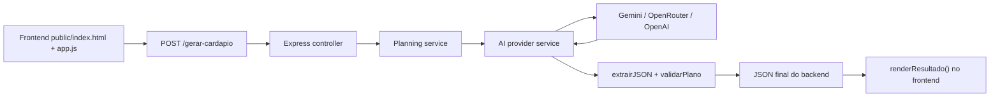
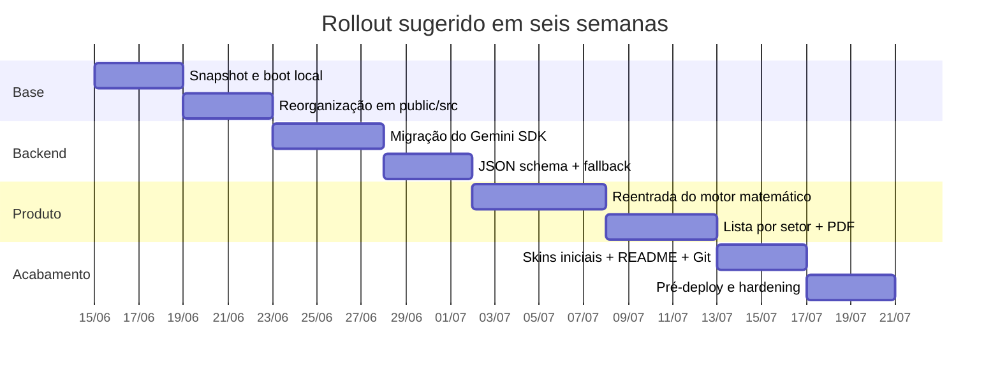

# Documento definitivo do Chef IA Studio

## Resumo executivo

O caminho mais seguro para o **Chef IA Studio** é tratar o projeto como uma migração em duas trilhas: primeiro estabilizar a **versão simples que já roda com Express + Gemini**, e só depois reincorporar, em partes, o **protótipo avançado do motor matemático**. Hoje, os arquivos enviados mostram um frontend simples com campos como `tipo`, `pessoas`, `restricoes` e `userChat`, um `script.js` que envia `POST /gerar-cardapio`, e um `server.js` que usa Express, `dotenv` e `@google/generative-ai`; ao mesmo tempo, há fragmentos de uma versão muito mais ambiciosa, com `adultos`, `criancas`, `motorEventos`, `window.storage`, PDF e até chamada direta à Anthropic no navegador. Isso confirma que o problema central não é “falta de ideia”, e sim **deriva de arquitetura entre protótipos**. fileciteturn0file6 fileciteturn0file10 fileciteturn0file11 fileciteturn0file15 fileciteturn0file16 fileciteturn0file18 fileciteturn0file19

A recomendação técnica é migrar o ambiente para **Node.js LTS no VS Code**, manter o app inicialmente em **HTML/CSS/JS vanilla + Express**, e atualizar a integração com Gemini para o **SDK atual `@google/genai`**, porque a documentação oficial do Google hoje recomenda explicitamente o **Google GenAI SDK**, marca as bibliotecas legadas como não ativamente mantidas e registra a família legada — incluindo `@google/generative-ai` no JavaScript — como deprecada desde 30 de novembro de 2025. Além disso, as dependências atuais do projeto já exigem **Node >= 18**, enquanto a página oficial do Node lista a linha **v24.16.0 LTS** como opção recomendada no momento. fileciteturn0file8 citeturn8view0turn16view0turn17view0turn17view2

Para começar com custo baixo, a rota mais coerente é **Gemini Developer API** no backend. A página oficial de pricing do Gemini informa uma **camada gratuita** para começar, com acesso ao Google AI Studio e tokens gratuitos dentro de limites, embora o plano free use conteúdo para melhorar os produtos; quando você migrar para produção ou quiser mais privacidade, pode subir para plano pago ou adotar um gateway como o **OpenRouter**, que mantém compatibilidade com o formato OpenAI e oferece roteamento/fallback entre providers. Já a **OpenAI API** deve ser tratada como opção paga por padrão: a documentação atual mostra cobrança por uso, Quickstart com `OPENAI_API_KEY`, e a própria página de pricing afirma que uso de Playground é cobrado como uso normal e que a API é faturada separadamente do ChatGPT Plus/Business/Enterprise. citeturn3view0turn8view3turn15view0turn15view1turn4view0turn9view0turn9view1turn5view0turn5view2

O resumo prático é este: **estabilize a versão simples, modularize as pastas, troque o SDK legada do Gemini, normalize o contrato do backend, adicione parsing robusto/JSON schema, e só então religue o motor avançado**. Essa ordem preserva o que já funciona e impede que o projeto continue “misturando épocas” de código. fileciteturn0file6 fileciteturn0file10 fileciteturn0file11 fileciteturn0file19

## Diagnóstico do estado atual

Os arquivos atuais comprovam um núcleo mínimo funcional: `index.html`, `style.css`, `script.js`, `server.js`, `package.json` e `package-lock.json`. O `package.json` usa `npm start` com `node server.js`, e as dependências instaladas hoje são `express`, `dotenv` e `@google/generative-ai`. O frontend simples pergunta tipo de evento, convidados, restrições e observações; o JavaScript monta um prompt textual; o backend recebe `req.body.prompt`, chama o Gemini e tenta devolver JSON ao frontend. fileciteturn0file7 fileciteturn0file8 fileciteturn0file6 fileciteturn0file10 fileciteturn0file11

Ao mesmo tempo, os fragmentos avançados mostram outra linha de evolução: uma UI diferente, com `tipo_cat`, `adultos`, `criancas`, cálculo local via `motorEventos`, organização por setores, histórico com `window.storage`, builders de HTML/PDF e uma função `gerarComIA()` que chega a fazer `fetch('https://api.anthropic.com/v1/messages')` diretamente do navegador. Isso não é só “mais recurso”; é **outra arquitetura**. Ela conflita com a atual porque muda IDs, payloads, fluxo de dados e até o modelo de segurança das chaves. fileciteturn0file15 fileciteturn0file16 fileciteturn0file18 fileciteturn0file19 fileciteturn0file20

Há ainda sinais de dívida técnica que devem entrar na limpeza inicial. O CSS enviado repete blocos de comentário e `:root`, o que sugere cópias parciais e fusões manuais. O servidor atual usa `express.static(__dirname)` e `sendFile(path.join(__dirname, 'index.html'))`, o que significa que hoje a camada estática ainda está “solta” na raiz do projeto; ao migrar para `public/`, isso terá de ser ajustado. Além disso, o backend usa `JSON.parse(cleanJson)` diretamente, sem validação de schema nem fallback amigável, o que torna a resposta da IA um ponto frágil. fileciteturn0file12 fileciteturn0file11

| Área | O que existe hoje | Problema detectado | Decisão recomendada |
|---|---|---|---|
| Frontend base | Formulário simples com `tipo`, `pessoas`, `restricoes`, `userChat` e botão que chama `gerarTudo()` fileciteturn0file6 fileciteturn0file10 | Está acoplado a um prompt “texto livre” | **Congelar como MVP de recuperação** |
| Backend atual | Express + `@google/generative-ai` + `GOOGLE_API_KEY` + `POST /gerar-cardapio` fileciteturn0file11 fileciteturn0file7 | Usa SDK/modelo legados e parse frágil | **Atualizar para `@google/genai` + structured output** |
| Protótipo avançado | Motor matemático, setores, histórico, PDF, lista completa, Anthropic direta no browser fileciteturn0file16 fileciteturn0file18 fileciteturn0file19 fileciteturn0file20 | Mistura IDs, storage e fluxo de IA incompatíveis com a base | **Guardar em `legacy/` e reimportar por módulos** |
| Segurança | Há fragmento com chamada direta à API de modelo no frontend fileciteturn0file19 | Exposição de chave se isso voltar ao app final | **Toda IA deve passar pelo backend** |
| Estilo/CSS | Tema premium forte com duplicações de blocos no CSS fileciteturn0file12 | Difícil manter e revisar | **Deduplicar e dividir por arquivo único de tema** |

A conclusão do diagnóstico é objetiva: **o projeto não está perdido; ele está misturado**. A sua prioridade não deve ser “criar mais feature”, e sim **reconstruir uma única linha de execução coerente** com contratos estáveis entre frontend, backend e provedor de IA. fileciteturn0file10 fileciteturn0file11 fileciteturn0file19

## Ambiente e execução local

Para o ambiente local, a combinação recomendada é **Node.js LTS + VS Code + terminal integrado do VS Code**. A página oficial do Node lista a versão **v24.16.0 LTS** como a linha LTS atual, enquanto o `package-lock.json` do seu projeto mostra que dependências centrais como `@google/generative-ai` e Express 5 exigem **Node >= 18**. Na prática, instalar a LTS mais recente reduz incompatibilidades e te coloca acima do mínimo exigido pelo projeto. citeturn8view0 fileciteturn0file8

O VS Code continua sendo a melhor escolha para você porque a documentação oficial cobre instalação, terminal integrado, configuração e Marketplace de extensões; além disso, o Marketplace identifica extensões pelo par `publisher.extensionId`, o que facilita replicar o setup em qualquer máquina. Para este projeto, o ideal é instalar pelo menos: **Prettier**, **ESLint**, **DotENV**, **Error Lens**, **GitLens** e **REST Client**. Eu não recomendo usar Live Server como fluxo principal aqui, porque seu app real depende de **Express** e da rota `/gerar-cardapio`; portanto, o navegador deve abrir a aplicação servida pelo Node, não um servidor estático separado. citeturn8view1turn8view2

### Preparação do ambiente

No terminal, a sequência inicial deve ser esta:

```bash
node -v
npm -v
npm install
npm start
```

O `npm start` funciona porque o `package.json` atual define `"start": "node server.js"`. Quando o servidor subir, ele deve exibir algo equivalente ao log já existente no arquivo atual, informando que o app está rodando em `http://localhost:3000`. fileciteturn0file7 fileciteturn0file11

### Arquivo de ambiente

O seu `.env` não deve ser enviado em chat nem commitado. No estado atual, o backend usa `GOOGLE_API_KEY`; porém, a documentação oficial do Gemini mostra o padrão `GEMINI_API_KEY`. A forma mais prática de migrar sem quebrar nada é **aceitar os dois nomes temporariamente** e padronizar depois. fileciteturn0file11 citeturn15view0

Exemplo recomendado de `.env` local:

```env
PORT=3000

# Provider principal agora
GEMINI_API_KEY=sua_chave_aqui
GOOGLE_API_KEY=sua_chave_aqui

# Seleção de provider
AI_PROVIDER=gemini

# Opcionais futuros
OPENROUTER_API_KEY=
OPENAI_API_KEY=
UNSPLASH_ACCESS_KEY=
PEXELS_API_KEY=
EMAILJS_PUBLIC_KEY=
EMAILJS_SERVICE_ID=
EMAILJS_TEMPLATE_ID=

# Sugestões de nomes para serviços futuros
SUPABASE_URL=
SUPABASE_PUBLISHABLE_KEY=
SUPABASE_SECRET_KEY=
FIREBASE_API_KEY=
FIREBASE_AUTH_DOMAIN=
FIREBASE_PROJECT_ID=
FIREBASE_STORAGE_BUCKET=
FIREBASE_MESSAGING_SENDER_ID=
FIREBASE_APP_ID=
```

Esses nomes misturam dois tipos de chave: **nomes já vistos na documentação oficial** — como `GEMINI_API_KEY`, `OPENAI_API_KEY`, `NEXT_PUBLIC_SUPABASE_URL`/publishable key e a `publicKey` do EmailJS — e **nomes sugeridos de aplicação** para você manter coerência dentro do Express. O importante é documentar bem e não expor segredos no frontend. citeturn15view0turn9view0turn10view0turn7view0turn9view8

### Arquivo de exclusão

O `.gitignore` inicial deve ser este:

```gitignore
node_modules/
.env
.env.*
dist/
coverage/
*.log
.DS_Store
.vscode/settings.json
```

Se o projeto entrar em fase mais estável, **mantenha `package-lock.json` versionado** para reprodutibilidade entre ambientes; neste momento, ele já documenta o conjunto de dependências que o app usa hoje. fileciteturn0file8

## Estrutura final proposta

A sua estrutura final deve separar **estático**, **backend**, **serviços de IA**, **prompts**, **utilitários** e **legados**. Isso é especialmente importante porque o servidor atual serve tudo diretamente da raiz com `express.static(__dirname)`, enquanto o app ideal precisa de uma pasta pública clara e de um backend que possa crescer sem virar outro monolito. fileciteturn0file11

```mermaid
flowchart TD
    root["chef-ia-studio/"]
    root --> public["public/"]
    root --> src["src/"]
    root --> legacy["legacy/"]
    root --> server["server.js"]
    root --> pkg["package.json"]
    root --> env[".env"]
    root --> ignore[".gitignore"]
    root --> readme["README.md"]

    public --> pindex["index.html"]
    public --> css["css/"]
    public --> js["js/"]
    public --> assets["assets/"]

    css --> style["style.css"]
    js --> app["app.js"]
    js --> render["render.js"]
    js --> state["state.js"]
    js --> ui["ui.js"]

    assets --> images["images/"]
    assets --> icons["icons/"]

    src --> config["config/"]
    src --> routes["routes/"]
    src --> controllers["controllers/"]
    src --> services["services/"]
    src --> prompts["prompts/"]
    src --> utils["utils/"]
    src --> middleware["middleware/"]

    config --> envjs["env.js"]
    routes --> planningRoutes["planning.routes.js"]
    controllers --> planningController["planning.controller.js"]

    services --> ai["ai/"]
    services --> planning["planning/"]

    ai --> gemini["gemini.service.js"]
    ai --> openrouter["openrouter.service.js"]
    ai --> openai["openai.service.js"]
    ai --> providerFactory["providerFactory.js"]

    planning --> motor["motor.service.js"]
    planning --> shopping["shopping.service.js"]
    planning --> exportSvc["export.service.js"]

    prompts --> menuPrompt["menu.prompt.js"]
    prompts --> eventPrompt["event.prompt.js"]

    utils --> extract["extract-json.js"]
    utils --> validate["validate-plan.js"]
    utils --> logger["logger.js"]

    middleware --> errorHandler["error-handler.js"]
    middleware --> rateLimit["rate-limit.js"]

    legacy --> simple["simple-current/"]
    legacy --> advanced["advanced-claude-fragments/"]
```

### Mapeamento de arquivos

| Origem atual | Destino sugerido | Observação |
|---|---|---|
| `index.html` atual | `public/index.html` | Deixar só HTML e CDNs temporários |
| `style.css` atual | `public/css/style.css` | Deduplicar blocos e variáveis |
| `script.js` atual | `public/js/app.js` | UI + `fetch` para backend |
| `server.js` atual | `server.js` + `src/...` | Manter bootstrap simples e migrar lógica para `src/` |
| Fragmentos avançados do Claude | `legacy/advanced-claude-fragments/` | Não misturar antes da estabilização |
| Protótipo simples atual | `legacy/simple-current/` | Backup antes da refatoração |

### Regras de separação ao migrar código do Claude

1. **`index.html`** deve conter apenas marcação, links de CSS e scripts.
2. **`style.css`** recebe todo o conteúdo do `<style>...</style>`, **sem** as tags.
3. **`app.js`** recebe todo o conteúdo do `<script>...</script>`, **sem** as tags.
4. Tudo que for **prompt**, **validação**, **fetch**, **renderização** ou **motor matemático** deve sair de um único arquivo com o tempo.
5. Nunca misture no mesmo ciclo os IDs da versão simples e os IDs da versão avançada.
6. Qualquer trecho vindo do Claude que faça `fetch` direto para provider no browser vai para **`legacy/`**, não para o build principal.

Essa separação é necessária porque os próprios arquivos enviados mostram hoje duas famílias de IDs e fluxos diferentes: a família simples baseada em `tipo/pessoas/restricoes/userChat`, e a família avançada baseada em `tipo_cat/adultos/criancas/tema/rest/obs`, além de `window.storage` e chamada direta à Anthropic. fileciteturn0file10 fileciteturn0file15 fileciteturn0file18 fileciteturn0file19

## Plano de migração e testes

A migração deve ser feita por **fases curtas, testáveis e reversíveis**. Como o backend atual já sobe com Express e expõe `/gerar-cardapio`, o melhor ponto de partida é **fazer a versão simples responder localmente antes de qualquer reescrita maior**. Depois, vem a troca do SDK do Gemini, a robustez de JSON e, por último, a absorção do motor avançado. fileciteturn0file11 fileciteturn0file10 citeturn16view0turn24view0



### Fase de snapshot e recuperação

**Objetivo:** congelar o que existe e garantir que a versão simples sobe.

**Comandos:**

```bash
mkdir -p legacy/simple-current
cp index.html legacy/simple-current/index.html
cp style.css legacy/simple-current/style.css
cp script.js legacy/simple-current/script.js
cp server.js legacy/simple-current/server.js
cp package.json legacy/simple-current/package.json
cp package-lock.json legacy/simple-current/package-lock.json

npm install
npm start
```

**Critérios de sucesso:**

- o terminal mostra o log de subida do servidor;
- `http://localhost:3000` abre;
- o formulário simples renderiza;
- o botão chama `gerarTudo()`;
- a aba Network mostra `POST /gerar-cardapio`. fileciteturn0file11 fileciteturn0file10

### Fase de reorganização estática

**Objetivo:** mover frontend para `public/` e ajustar o servidor.

Crie a estrutura:

```bash
mkdir -p public/css public/js public/assets/images src/config src/routes src/controllers src/services/ai src/services/planning src/prompts src/utils src/middleware legacy/advanced-claude-fragments
mv index.html public/index.html
mv style.css public/css/style.css
mv script.js public/js/app.js
```

Depois, troque o bootstrap do `server.js` para servir `public/`:

```js
const express = require("express");
const path = require("path");
require("dotenv").config();

const app = express();
app.use(express.json());
app.use(express.static(path.join(__dirname, "public")));

app.get("/", (_req, res) => {
  res.sendFile(path.join(__dirname, "public", "index.html"));
});

app.listen(process.env.PORT || 3000, () => {
  console.log(`✅ Chef IA Rodando! Acesse: http://localhost:${process.env.PORT || 3000}`);
});
```

Essa mudança é obrigatória porque o `server.js` atual serve a raiz do projeto, não uma pasta pública dedicada. fileciteturn0file11

### Fase de estabilização do contrato da rota

Hoje, a rota existente espera um body com `prompt`, porque o frontend simples envia `JSON.stringify({ prompt: prompt })`. Este é o **payload atual de compatibilidade**:

```bash
curl -X POST http://localhost:3000/gerar-cardapio \
  -H "Content-Type: application/json" \
  -d "{\"prompt\":\"Atue como um Chef de Eventos profissional. Planeje um evento de casamento para 50 pessoas.\"}"
```

O próximo contrato deve parar de enviar “prompt pronto” do frontend e enviar **dados estruturados**, deixando o prompt ser montado no backend. O payload-alvo recomendado é este:

```json
{
  "tipo": "casamento",
  "adultos": 50,
  "criancas": 8,
  "sofisticacao": "elegante",
  "refeicao": "almoco_jantar",
  "duracao": 6,
  "tema": "clássico com dourado",
  "alcool": true,
  "restricoes": "sem glúten para 2 convidados",
  "observacoes": "foco em frutos do mar e sobremesas leves"
}
```

Essa mudança reduz acoplamento, protege melhor a lógica de prompt, centraliza schema e facilita trocar Gemini por OpenRouter/OpenAI sem mexer no frontend. Os próprios arquivos enviados mostram que hoje existem dois contratos implícitos: o contrato simples via `prompt`, e o contrato avançado com campos estruturados. fileciteturn0file10 fileciteturn0file19

### Fase de atualização do Gemini

Seu backend atual usa `@google/generative-ai` e `gemini-pro`. A documentação oficial atual recomenda o **Google GenAI SDK** (`@google/genai`) e usa exemplos com `gemini-3.5-flash`. Por isso, a migração correta é:

```bash
npm uninstall @google/generative-ai
npm install @google/genai express dotenv cors zod express-rate-limit
```

Exemplo de serviço novo para `src/services/ai/gemini.service.js`:

```js
const { GoogleGenAI } = require("@google/genai");

const apiKey = process.env.GEMINI_API_KEY || process.env.GOOGLE_API_KEY;
const ai = new GoogleGenAI({ apiKey });

async function gerarPlanoEstruturado({ prompt, schema }) {
  const response = await ai.models.generateContent({
    model: "gemini-3.5-flash",
    contents: prompt,
    config: schema
      ? {
          responseFormat: {
            text: {
              mimeType: "application/json",
              schema,
            },
          },
        }
      : undefined,
  });

  return response.text;
}

module.exports = { gerarPlanoEstruturado };
```

Essa atualização segue diretamente a orientação atual do Google para JavaScript/TypeScript e ajuda a sair de uma biblioteca legada para a biblioteca oficial recomendada. citeturn16view0turn17view2turn8view3turn24view0

### Fase de tratamento robusto da resposta da IA

A maior fragilidade do backend atual é esta linha conceitual: **“limpar markdown e fazer `JSON.parse`”**. Isso quebra sempre que o modelo devolver texto adicional, vírgulas ruins, campos faltando ou schema levemente divergente. O ideal é ter duas proteções:

1. **Structured output / JSON schema**, quando o provider suportar.
2. **Fallback com `extrairJSON()` + `validarPlano()`**, caso a resposta ainda venha imperfeita.

Exemplo de `src/utils/extract-json.js`:

```js
function extrairJSON(raw) {
  if (!raw || typeof raw !== "string") {
    throw new Error("Resposta vazia da IA.");
  }

  const limpado = raw.replace(/```json|```/gi, "").trim();

  // tentativa direta
  try {
    return JSON.parse(limpado);
  } catch {}

  // procura primeiro objeto JSON bem formado
  const inicio = limpado.indexOf("{");
  if (inicio === -1) {
    throw new Error("Nenhum JSON encontrado na resposta.");
  }

  let profundidade = 0;
  let fim = -1;

  for (let i = inicio; i < limpado.length; i++) {
    const ch = limpado[i];
    if (ch === "{") profundidade++;
    if (ch === "}") profundidade--;
    if (profundidade === 0) {
      fim = i;
      break;
    }
  }

  if (fim === -1) {
    throw new Error("JSON incompleto na resposta.");
  }

  const trecho = limpado.slice(inicio, fim + 1);
  return JSON.parse(trecho);
}

module.exports = { extrairJSON };
```

Exemplo de `src/utils/validate-plan.js`:

```js
function validarPlano(data) {
  if (!data || typeof data !== "object") {
    throw new Error("Plano inválido.");
  }

  if (!Array.isArray(data.cardapio)) data.cardapio = [];
  if (!Array.isArray(data.receitas)) data.receitas = [];
  if (!Array.isArray(data.lista_compras)) data.lista_compras = [];
  if (!Array.isArray(data.utensilios)) data.utensilios = [];
  if (typeof data.resumo_chef !== "string") data.resumo_chef = "Resumo indisponível.";

  return data;
}

function criarFallback(mensagem) {
  return {
    cardapio: [],
    receitas: [],
    lista_compras: [],
    utensilios: [],
    resumo_chef: mensagem || "A IA não retornou um plano válido desta vez."
  };
}

module.exports = { validarPlano, criarFallback };
```

A página oficial de **Structured outputs** do Gemini existe exatamente para esse tipo de problema: ela recomenda usar JSON Schema para resultados previsíveis e tipados, o que simplifica muito a extração de dados estruturados. citeturn24view0

### Checklist de testes locais

Depois de cada fase, rode este checklist:

- **Servidor sobe**
  ```bash
  npm start
  ```
  Resultado esperado: log de subida e porta 3000. fileciteturn0file11

- **GET raiz**
  Abra `http://localhost:3000`.

- **POST da rota atual**
  Use o `curl` com `prompt` mostrado acima.

- **Teste de erro controlado**
  Envie body vazio:
  ```bash
  curl -X POST http://localhost:3000/gerar-cardapio \
    -H "Content-Type: application/json" \
    -d "{}"
  ```

- **Inspeção no navegador**
  Abra DevTools → Network → `POST /gerar-cardapio` → verifique:
  - Request Payload
  - Response
  - Status code
  - tempo de resposta

- **Inspeção no terminal**
  Verifique:
  - exceptions do provider,
  - erros de JSON,
  - variáveis ausentes,
  - timeouts.

- **Teste de provider sem chave**
  Remova a chave do `.env` e confirme que o backend devolve erro amigável.

- **Teste de fallback**
  Force um prompt que faça o modelo responder texto fora do schema e valide se o backend ainda devolve JSON mínimo.

Esse checklist é o seu “ritual” a cada alteração: **subiu, carregou, postou, respondeu, renderizou**. Qualquer coisa além disso vem depois. fileciteturn0file10 fileciteturn0file11

## Integrações, chaves e segurança

A comparação abaixo resume as páginas oficiais de pricing/docs dos serviços mais úteis para o Chef IA Studio. Onde a camada gratuita é clara nas páginas oficiais, eu marquei diretamente; onde o serviço é mais “gateway” ou a pricing é dinâmica, mantive uma observação cautelosa. citeturn3view0turn16view0turn4view0turn5view0turn5view2turn6view0turn9view3turn11view0turn9view7turn7view0turn6view4

| Serviço | Finalidade | Custo estimado | Camada gratuita | Nota |
|---|---|---:|---|---|
| Gemini Developer API | Geração principal de cardápio/plano | Grátis até limites; pago acima | Sim | Melhor opção inicial para você porque já está próxima do projeto atual e a documentação atual recomenda o SDK novo. |
| OpenRouter | Gateway multi-modelo | Variável conforme modelo/provedor | Variável; não assuma como estável | Ótimo para fallback e troca de provider sem reescrever o app. |
| OpenAI API | Alternativa premium para texto/estrutura | Pago por token | Trate como pago | A própria pricing atual é por uso, separada do ChatGPT. |
| Unsplash API | Imagens editoriais/de ambientação | Demo com baixa cota; produção maior após aprovação | Sim | Exige atribuição e uso correto das URLs/hotlinking. |
| Pexels API | Imagens de apoio para pratos/eventos | Quota mensal controlada por headers | Sim | Simples de integrar e com chave instantânea para conta de dev. |
| EmailJS | Enviar relatório por e-mail no MVP | US$ 0 a partir do plano free | Sim | Bom para MVP sem backend de e-mail dedicado. |
| Firebase | Auth, Firestore, Hosting opcional | Spark no-cost; pago conforme escala | Sim | Útil quando você entrar em login e persistência. |
| Supabase | Auth, Postgres, Storage opcional | Freemium; confirme pricing atual | Consultar pricing atual | Muito bom para banco/Auth mais “SQL-first”. |

### Chaves e identificadores recomendados

| Serviço | Obrigatório agora | Chaves/IDs | Observação |
|---|---|---|---|
| Gemini | Sim | `GEMINI_API_KEY` ou `GOOGLE_API_KEY` | O código atual usa `GOOGLE_API_KEY`; a doc atual mostra `GEMINI_API_KEY`. |
| OpenRouter | Opcional | `OPENROUTER_API_KEY` | Pode usar headers opcionais `HTTP-Referer` e `X-OpenRouter-Title`. |
| OpenAI | Opcional | `OPENAI_API_KEY` | Quickstart oficial usa variável de ambiente com esse nome. |
| Unsplash | Opcional | `UNSPLASH_ACCESS_KEY` | Access key pública para busca de imagens, respeitando guidelines/hotlinking. |
| Pexels | Opcional | `PEXELS_API_KEY` | Enviada no header `Authorization`. |
| EmailJS | Opcional | `EMAILJS_PUBLIC_KEY`, `EMAILJS_SERVICE_ID`, `EMAILJS_TEMPLATE_ID` | Bom para enviar relatório/export sem backend SMTP. |
| Firebase | Opcional | `FIREBASE_API_KEY`, `FIREBASE_AUTH_DOMAIN`, `FIREBASE_PROJECT_ID`, `FIREBASE_STORAGE_BUCKET`, `FIREBASE_MESSAGING_SENDER_ID`, `FIREBASE_APP_ID` | Nomes sugeridos para seu `.env`; a doc oficial usa um `firebaseConfig`. |
| Supabase | Opcional | `SUPABASE_URL`, `SUPABASE_PUBLISHABLE_KEY`, `SUPABASE_SECRET_KEY` | Para frontend use somente chave publicável; segredo só no backend. |

Google mostra que a chave do Gemini pode ser passada por variável de ambiente ou header `x-goog-api-key`; OpenAI Quickstart usa `OPENAI_API_KEY`; OpenRouter usa `Authorization: Bearer <OPENROUTER_API_KEY>` e aceita os headers `HTTP-Referer` e `X-OpenRouter-Title`; Supabase diferencia chave publicável e chave secreta; EmailJS inicializa no browser com uma **public key**. citeturn15view0turn15view1turn9view0turn5view0turn5view2turn7view0turn10view0

### Segurança operacional

A regra mais importante é: **nenhuma chave secreta pode ficar no frontend**. O próprio Help Center da OpenAI lembra para não compartilhar a API key, e a prática correta para qualquer provider é manter as credenciais no backend, usando `.env` + proxy Express. No seu caso, isso é ainda mais crítico porque já apareceu um fragmento com chamada direta à Anthropic no navegador. citeturn18view0 fileciteturn0file19

Se frontend e backend rodarem em origens diferentes no futuro, configure **CORS explicitamente**. A MDN define CORS como um mecanismo baseado em headers HTTP que permite a um servidor declarar quais origens externas podem acessar seus recursos e explica que navegadores bloqueiam requisições cross-origin sem os headers corretos. Em outras palavras: se você separar `frontend.example.com` e `api.example.com`, trate CORS como configuração deliberada, não como detalhe. citeturn23view0

Também vale proteger custo e abuso desde cedo. A página de pricing da OpenAI explica que é possível definir orçamento mensal e alertas; o pricing do Gemini mostra claramente a diferença entre free tier e paid tier; e a doc do OpenRouter documenta fallback e roteamento entre providers, o que é ótimo para resiliência, mas não substitui limite próprio no seu backend. Em produção pública, coloque pelo menos **`express-rate-limit`**, timeout nas chamadas de IA, logs sem segredos, validação de input e retorno de erro padronizado. citeturn4view0turn3view0turn5view2

### Arquiteturas alternativas

| Arquitetura | Como funciona | Prós | Contras | Quando usar |
|---|---|---|---|---|
| Gemini direto via Express | Frontend → Express → Gemini | Mais simples, barato para começar, alinhado ao código atual | Fica preso a um provider | **Agora** |
| OpenRouter como gateway | Frontend → Express → OpenRouter → provider | Troca de modelo rápida, fallback, compatibilidade OpenAI | Mais uma camada para operar | Quando quiser multi-modelo |
| OpenAI direto | Frontend → Express → OpenAI | Ecossistema forte, SDK maduro | Custo e sem free tier pública comparável nas páginas atuais | Quando precisar de stack OpenAI |
| Proxy serverless | Frontend → Function → provider | Deploy simples e escalável | Observabilidade e debugging podem ficar piores para quem ainda está organizando o projeto | Depois do MVP local |
| Gemini + motor local | Frontend → Express → motor local + Gemini | Cálculo determinístico + criatividade da IA | Exige separar muito bem lógica e apresentação | Arquitetura-alvo ideal |

O recommendation real aqui é simples: **comece com Gemini direto no Express**, deixe o backend pronto para trocar provider, e introduza OpenRouter só quando a base já estiver estável. citeturn16view0turn5view0turn5view2turn4view0

## Skins, habilidades e roadmap

Os arquivos atuais já mostram uma identidade visual premium em dourado/preto, com carrossel, hero e pitch deck, e os fragmentos avançados deixam claro que o projeto comporta múltiplas “caras” sem perder a essência. Isso é bom: sua frente de produto já tem matéria-prima para virar **sistema com tema** em vez de virar um HTML gigante sem padrão. fileciteturn0file6 fileciteturn0file12 fileciteturn0file21

### Skins visuais sugeridas

| Skin | Descrição | Prioridade |
|---|---|---|
| **Luxe Gold** | Preto, dourado e serif elegante. É a continuação natural do visual atual. | Alta |
| **Minimal Light** | Fundo claro, tipografia limpa, foco em produtividade e legibilidade. | Alta |
| **Corporate Slate** | Cinza-azulado, visual executivo para eventos corporativos e workshops. | Média |
| **Rustic Garden** | Tons terrosos, verde-oliva e textura suave para casamentos/noivados/chás. | Média |
| **Kids Party Pop** | Cores vibrantes, cards arredondados, ilustrações lúdicas e foco na versão infantil. | Média |
| **Neon Night** | Roxo/azul/rosa escuro, ideal para balada, formatura e festa noturna. | Baixa |

### Habilidades funcionais sugeridas

| Habilidade | O que faz | Prioridade |
|---|---|---|
| **Motor matemático local** | Calcula quantidades, staff, bebidas, espaço e margem sem depender da IA. | Alta |
| **Provider switch** | Permite alternar Gemini/OpenRouter/OpenAI por configuração. | Alta |
| **Structured output** | Obriga a IA a devolver JSON previsível por schema. | Alta |
| **Lista de compras por setor** | Agrupa compras em açougue, hortifruti, bebidas, secos etc. | Alta |
| **Histórico local** | Salva e reabre eventos no navegador com `localStorage` ou IndexedDB. | Média |
| **Exportação PDF** | Gera relatório final do evento. | Média |
| **Envio por e-mail** | Compartilha planejamento via EmailJS ou backend próprio. | Média |
| **Camada de imagens** | Busca imagens de referência por Unsplash/Pexels ou upload do usuário. | Baixa |

### Timeline sugerida



### Milestones por semana

| Semana | Entregável | Critério de sucesso |
|---|---|---|
| Semana um | Projeto sobe localmente de forma estável | `npm start`, `GET /`, `POST /gerar-cardapio` funcionando |
| Semana dois | Estrutura `public/` e `src/` consolidada | Nenhum frontend solto na raiz |
| Semana três | Gemini atualizado para SDK atual | Sem `@google/generative-ai`; usando `@google/genai` |
| Semana quatro | Respostas robustas | JSON schema ou fallback funcionando |
| Semana cinco | Motor matemático reintegrado | Quantidades locais + IA convivendo sem duplicação |
| Semana seis | Documentação, tema e pré-deploy | README pronto, Git organizado, checklist fechado |

A regra de ouro do roadmap é esta: **funcionar → organizar → calcular → salvar → exportar → embelezar → escalar**. Pular essa ordem é justamente o que costuma transformar um protótipo promissor em um amontoado de “patches”. 

## Material de apoio para o próximo chat e pré-deploy

O melhor formato para o próximo chat é você me mandar um **pacote de evidências**, não só “o código”. Isso significa: árvore de pastas, arquivos principais atualizados, logs do terminal, prints do Explorer do VS Code, erro do console do navegador e resposta da aba Network. **Não envie `.env` nem `node_modules/`**; o `.env` fica omitido e o `node_modules` é sempre recriável com `npm install`. fileciteturn0file7 fileciteturn0file8

### O que enviar no próximo chat

Envie exatamente isto:

1. **print ou texto da árvore de pastas**
   ```bash
   tree -L 3
   ```
   ou uma captura do Explorer do VS Code.

2. **arquivos principais**
   - `server.js`
   - `package.json`
   - `public/index.html`
   - `public/css/style.css`
   - `public/js/app.js`

3. **logs**
   - terminal após `npm start`
   - console do navegador
   - request/response do `POST /gerar-cardapio`

4. **informações de contexto**
   - qual provider quer manter primeiro: Gemini, OpenRouter ou OpenAI;
   - se quer seguir pela base simples ou já iniciar a fusão com o motor avançado.

### Template de README.md

```md
# Chef IA Studio

Aplicação web para planejamento inteligente de eventos com IA, motor matemático local e geração de relatórios.

## Estado atual

Projeto em migração para arquitetura modular com:
- frontend estático em `public/`
- backend Node.js + Express
- integração com provider de IA no backend
- plano para motor local, histórico, PDF e imagens

## Stack

- HTML, CSS, JavaScript
- Node.js
- Express
- Gemini / OpenRouter / OpenAI
- jsPDF
- GSAP
- Swiper

## Requisitos

- Node.js LTS
- npm
- VS Code

## Instalação

```bash
npm install
npm start
```

Abra:

```txt
http://localhost:3000
```

## Variáveis de ambiente

Crie um `.env`:

```env
PORT=3000
GEMINI_API_KEY=sua_chave
AI_PROVIDER=gemini
```

## Estrutura

```txt
public/
src/
server.js
package.json
.env
```

## Roadmap

- estabilizar versão simples
- modularizar frontend/backend
- migrar SDK do Gemini
- adicionar structured output e fallback
- reintegrar motor matemático
- adicionar PDF, histórico e e-mail
- preparar deploy

## Licença

Uso privado / portfólio, ajustar depois.
```

### Comandos Git iniciais

```bash
git init
git branch -M main
git add .
git commit -m "chore: snapshot inicial do Chef IA Studio"
```

Quando já existir um repositório remoto:

```bash
git remote add origin SEU_REPOSITORIO.git
git push -u origin main
```

### Checklist final de pré-deploy

Use esta lista antes de publicar qualquer versão:

- [ ] `npm install` roda sem erro
- [ ] `npm start` sobe o servidor
- [ ] `GET /` abre a aplicação
- [ ] `POST /gerar-cardapio` responde JSON válido
- [ ] provider escolhido está funcionando com chave válida
- [ ] nenhuma chave aparece no frontend
- [ ] `.env` está no `.gitignore`
- [ ] não existe chamada direta a provider do navegador
- [ ] logs não imprimem segredo
- [ ] fallback JSON trata respostas ruins da IA
- [ ] CORS está explícito se houver origem separada
- [ ] limite de requisição existe se a rota for pública
- [ ] README está atualizado
- [ ] `legacy/` guarda os protótipos antigos
- [ ] pelo menos uma skin base está consolidada
- [ ] PDF/export não quebra o app principal
- [ ] screenshots do projeto foram salvas para portfólio

### Prompts recomendados para gerar cardápios

**Gemini / OpenRouter / OpenAI — prompt base de MVP**

```txt
Você é um chef e planejador de eventos profissional.
Gere um plano para um evento com estes dados:

Tipo: {{tipo}}
Adultos: {{adultos}}
Crianças: {{criancas}}
Estilo: {{sofisticacao}}
Refeição: {{refeicao}}
Duração: {{duracao}} horas
Tema: {{tema}}
Álcool: {{alcool}}
Restrições: {{restricoes}}
Observações: {{observacoes}}

Responda apenas em JSON válido, sem markdown, com este schema:
{
  "cardapio": [
    {
      "nome": "string",
      "categoria": "Entrada|Principal|Acompanhamento|Sobremesa|Bebida",
      "descricao": "string"
    }
  ],
  "receitas": ["string"],
  "lista_compras": [
    { "item": "string", "quantidade": "string", "setor": "string" }
  ],
  "utensilios": ["string"],
  "resumo_chef": "string"
}
```

**Prompt com motor local resumido**

```txt
Você receberá um resumo calculado pelo motor local.
Use-o como verdade operacional e complemente apenas com criatividade, variedade gastronômica e organização.

Resumo do motor:
- salgados: {{salgados}}
- doces: {{doces}}
- bebidas não alcoólicas: {{bebidas_na}}
- bebidas alcoólicas: {{bebidas_alcool}}
- garçons: {{garcons}}
- espaço: {{espaco_m2}}
- orçamento estimado: {{orcamento}}

Agora gere JSON válido com cardápio, lista de compras por setor, utensílios e resumo final.
Não contradiga os números do motor.
```

### Exemplo de resposta JSON esperada do backend

```json
{
  "ok": true,
  "provider": "gemini",
  "plano": {
    "cardapio": [
      {
        "nome": "Mini tartar de salmão",
        "categoria": "Entrada",
        "descricao": "Entrada leve com cítricos e ervas"
      }
    ],
    "receitas": [
      "Temperar o salmão, finalizar com limão e montar em porções individuais."
    ],
    "lista_compras": [
      {
        "item": "salmão fresco",
        "quantidade": "3 kg",
        "setor": "acougue"
      }
    ],
    "utensilios": [
      "travessas frias",
      "pinças de empratamento"
    ],
    "resumo_chef": "Menu leve, elegante e adequado ao tema clássico."
  },
  "meta": {
    "tempo_ms": 1834,
    "schema_ok": true
  }
}
```

### Decisão prática final

Se você quiser usar este documento como guia literal, a sequência correta é:

1. subir a versão simples atual;
2. reorganizar em `public/` e `src/`;
3. migrar do SDK Gemini legado para o atual;
4. endurecer JSON e fallback;
5. só então importar o motor avançado;
6. depois ativar skins, histórico, PDF, imagens e e-mail.

Esse é o ponto em que o projeto deixa de ser “código gerado em blocos” e vira **produto organizado**. fileciteturn0file10 fileciteturn0file11 citeturn16view0turn24view0